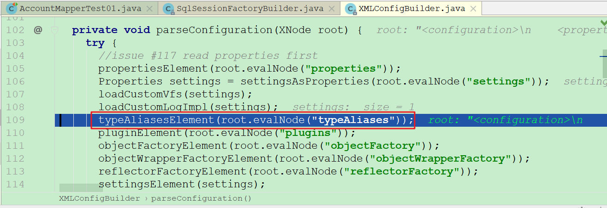
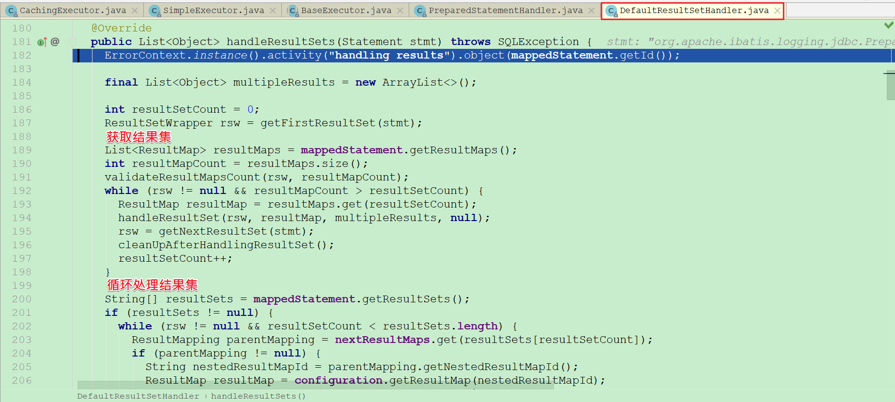

## 课程目标

目标1: 理解mybatis框架执行流程

目标2: 掌握通过debug跟踪学习源码方式

目标3: 熟悉mybatis框架的核心组件

目标4: 理解mybatis框架整体架构设计

目标5: 掌握mybatis框架相关的常见面试题


## 01、MyBatis：准备应用案例

+ MyBatis的前身就是iBatis，iBatis本是apache的一个开源项目2010年这个项目由apahce sofeware foundation 迁移到了google code,并且改名为MyBatis.
+ ibatis 一词来源于“internet”和“abatis”的组合,是一个基于Java的持久层框架.ibatis提供的持久层框架包括SQL Maps和Data Access Objects(DAO)
+ 总体来说 MyBatis 主要完成两件事情:
+ + 根据 JDBC 规范建立与数据库的连接.
  + 通过Annotaion+XML+Java反射技术,实现 Java 对象与关系数据库之间相互转化.

#### 1.1 创建数据库与模块

**操作步骤**

+ 创建数据库与表

  

  ```sql
  /*创建账户表*/
  create table account(
  	id int primary key auto_increment,
  	name varchar(40),
  	money float
  )ENGINE=InnoDB character set utf8 collate utf8_general_ci;
  
  /*初始化新增三个账户*/
  insert into account(name,money) values('小明',1000);
  insert into account(name,money) values('小花',1000);
  insert into account(name,money) values('小王',1000); 
  ```

+ 创建模块(mybatis-demo)

   

+ 配置pom.xml

  ```xml
  <?xml version="1.0" encoding="UTF-8"?>
  <project xmlns="http://maven.apache.org/POM/4.0.0"
           xmlns:xsi="http://www.w3.org/2001/XMLSchema-instance"
           xsi:schemaLocation="http://maven.apache.org/POM/4.0.0
           http://maven.apache.org/xsd/maven-4.0.0.xsd">
      <modelVersion>4.0.0</modelVersion>
  
      <groupId>cn.itcast</groupId>
      <artifactId>mybatis-demo</artifactId>
      <version>1.0-SNAPSHOT</version>
  
      <dependencies>
          <!-- 配置mybatis -->
          <dependency>
              <groupId>org.mybatis</groupId>
              <artifactId>mybatis</artifactId>
              <version>3.5.4</version>
          </dependency>
          <!-- 配置mysql驱动 -->
          <dependency>
              <groupId>mysql</groupId>
              <artifactId>mysql-connector-java</artifactId>
              <version>5.1.47</version>
          </dependency>
          <!-- 配置日志 -->
          <dependency>
              <groupId>log4j</groupId>
              <artifactId>log4j</artifactId>
              <version>1.2.17</version>
          </dependency>
          <!-- 配置junit -->
          <dependency>
              <groupId>junit</groupId>
              <artifactId>junit</artifactId>
              <version>4.12</version>
              <scope>test</scope>
          </dependency>
      </dependencies>
  </project>
  ```

+ 提供src/main/resources/log4j.properties

  ```properties
  log4j.rootLogger=DEBUG,stdout
  log4j.appender.stdout=org.apache.log4j.ConsoleAppender
  log4j.appender.stdout.layout=org.apache.log4j.PatternLayout
  log4j.appender.stdout.layout.ConversionPattern=%-d{yyyy-MM-dd HH:mm:ss,SSS} [%t] [%c]-[%p] %m%n
  ```

  

#### 1.2 基于mapper映射文件

**操作步骤**

+ 提供src/main/resources/mybatis-config.xml

  ```xml
  <?xml version="1.0" encoding="UTF-8"?>
  <!DOCTYPE configuration
          PUBLIC "-//mybatis.org//DTD Config 3.0//EN"
          "http://mybatis.org/dtd/mybatis-3-config.dtd">
  <configuration>
  
      <!-- 配置加载属性文件 -->
      <properties resource="db.properties"/>
  
      <!-- 全局的设置信息-->
      <settings>
          <!-- 开启驼峰命名(方便自动映射) -->
          <setting name="mapUnderscoreToCamelCase" value="true"/>
      </settings>
  
      <!-- 配置类型别名 -->
      <typeAliases>
          <typeAlias type="cn.itcast.pojo.Account" alias="account"/>
      </typeAliases>
  
      <!-- 配置环境 -->
      <environments default="mysql">
          <environment id="mysql">
              <!-- 配置事务管理器 -->
              <transactionManager type="JDBC"/>
              <!-- 配置数据源 -->
              <dataSource type="POOLED">
                  <property name="driver" value="${driver}"/>
                  <property name="url" value="${url}"/>
                  <property name="username" value="${username}"/>
                  <property name="password" value="${password}"/>
              </dataSource>
          </environment>
      </environments>
  
      <mappers>
          <mapper resource="mappers/AccountMapper.xml"/>
      </mappers>
  </configuration>
  ```

+ 提供src/main/resources/db.properties

  ```properties
  driver=com.mysql.jdbc.Driver
  url=jdbc:mysql://localhost:3306/mybatis_db?characterEncoding=utf-8
  username=root
  password=root
  ```

+ 提供实体类: Account.java

  ```java
  package cn.itcast.pojo;
  
  /**
   * 账户实体类
   */
  public class Account {
      // 主键id
      private Integer id;
      // 姓名
      private String name;
      // 余额
      private Float money;
      // setter/getter/toString方法
      // 省略 ...
  }
  ```

+ 提供SQL映射文件: mappers/AccountMapper.xml

  ```xml
  <?xml version="1.0" encoding="UTF-8" ?>
  <!DOCTYPE mapper
          PUBLIC "-//mybatis.org//DTD Mapper 3.0//EN"
          "http://mybatis.org/dtd/mybatis-3-mapper.dtd">
  <mapper namespace="cn.itcast.mapper.AccountMapper">
      <!-- 主键id查询 -->
      <select id="findOne" resultType="account">
          select * from account where id = #{id}
      </select>
  
      <!-- 添加账户 -->
      <insert id="save" parameterType="account">
          insert into account(name,money) values(#{name},#{money})
      </insert>
  </mapper>
  ```

+ 提供测试类: cn.itcast.AccountMapperTest01.java

  ```java
  package cn.itcast;
  
  import cn.itcast.pojo.Account;
  import org.apache.ibatis.io.Resources;
  import org.apache.ibatis.session.SqlSession;
  import org.apache.ibatis.session.SqlSessionFactory;
  import org.apache.ibatis.session.SqlSessionFactoryBuilder;
  import org.junit.Test;
  
  import java.io.InputStream;
  
  /**
   * 测试类
   */
  public class AccountMapperTest01 {
  
      /** 根据主键id查询 */
      @Test
      public void findOne() throws Exception{
          // 1. 获取全局配置文件输入流
          InputStream inputStream = Resources.getResourceAsStream("mybatis-config.xml");
  
          // 2. 创建SqlSessionFactory
          SqlSessionFactory sqlSessionFactory = new SqlSessionFactoryBuilder()
                  .build(inputStream);
  
          // 3. 获取SqlSession
          SqlSession sqlSession = sqlSessionFactory.openSession();
  
          // 4. 用sqlSession执行CRUD
          Account account = sqlSession.selectOne("cn.itcast.mapper.AccountMapper.findOne", 1);
          System.out.println("account = " + account);
  
          // 5. 关闭sqlSession
          sqlSession.close();
      }
  
  
      /** 添加 */
      @Test
      public void save() throws Exception{
          // 1. 获取全局配置文件输入流
          InputStream inputStream = Resources.getResourceAsStream("mybatis-config.xml");
  
          // 2. 创建SqlSessionFactory
          SqlSessionFactory sqlSessionFactory = new SqlSessionFactoryBuilder()
                  .build(inputStream);
  
          // 3. 获取SqlSession
          SqlSession sqlSession = sqlSessionFactory.openSession();
  
          // 4. 用sqlSession执行CRUD
          Account account = new Account();
          account.setName("小李");
          account.setMoney(8000f);
          sqlSession.insert("cn.itcast.mapper.AccountMapper.save", account);
  
          // 5. 提交事务
          sqlSession.commit();
  
          // 6. 关闭sqlSession
          sqlSession.close();
      }
  }
  ```

+ 测试效果: 

   

   

  

#### 1.3 基于mapper访问接口

**操作步骤**

+ 提供mappper数据访问接口: cn.itcast.mapper.AccountMapper

  ```java
  package cn.itcast.mapper;
  import cn.itcast.pojo.Account;
  
  public interface AccountMapper {
      // 根据主键id查询
      Account findOne(Integer id);
      // 添加账户
      int save(Account account);
  }
  ```

+ 提供测试类: cn.itcast.AccountMapperTest02.java

  ```java
  package cn.itcast;
  
  import cn.itcast.mapper.AccountMapper;
  import cn.itcast.pojo.Account;
  import org.apache.ibatis.io.Resources;
  import org.apache.ibatis.session.SqlSession;
  import org.apache.ibatis.session.SqlSessionFactory;
  import org.apache.ibatis.session.SqlSessionFactoryBuilder;
  import org.junit.Test;
  
  import java.io.InputStream;
  
  /**
   * 测试类
   */
  public class AccountMapperTest02 {
  
      /** 根据主键id查询 */
      @Test
      public void findOne() throws Exception{
          // 1. 获取全局配置文件输入流
          InputStream inputStream = Resources.getResourceAsStream("mybatis-config.xml");
  
          // 2. 创建SqlSessionFactory
          SqlSessionFactory sqlSessionFactory = new SqlSessionFactoryBuilder()
                  .build(inputStream);
  
          // 3. 获取SqlSession
          SqlSession sqlSession = sqlSessionFactory.openSession();
  
          // 4. 获取数据访问接口代理对象
          AccountMapper accountMapper = sqlSession.getMapper(AccountMapper.class);
          Account account = accountMapper.findOne(1);
          System.out.println("account = " + account);
  
          // 5. 关闭sqlSession
          sqlSession.close();
      }
  
  
      /** 添加 */
      @Test
      public void save() throws Exception{
          // 1. 获取全局配置文件输入流
          InputStream inputStream = Resources.getResourceAsStream("mybatis-config.xml");
  
          // 2. 创建SqlSessionFactory
          SqlSessionFactory sqlSessionFactory = new SqlSessionFactoryBuilder()
                  .build(inputStream);
  
          // 3. 获取SqlSession
          SqlSession sqlSession = sqlSessionFactory.openSession();
  
          // 4. 获取数据访问接口代理对象
          AccountMapper accountMapper = sqlSession.getMapper(AccountMapper.class);
          Account account = new Account();
          account.setName("小李");
          account.setMoney(8000f);
          accountMapper.save(account);
  
          // 5. 提交事务
          sqlSession.commit();
  
          // 6. 关闭sqlSession
          sqlSession.close();
      }
  }
  ```

+ 测试效果

   

   

  


## 02、MyBatis：框架执行流程

+ 执行流程图:

    

+ 执行流程说明:

  + **第1步: 加载配置文件**
    + 核心配置文件: mybatis-config.xml (配置类型别名、环境、设置信息等)。
    + sql语句映射文件：AccountMapper.xml (定义CRUD语句、缓存等)。
  + **第2步: 解析配置文件**
    + 用SAX解析XML文件中的内容，然后把内容全部封装到Configuration对象。

    + 创建SqlSessionFactory，把Configuration对象作为参数传入。

  + **第3步: 获取SqlSession对象**
    + 调用DefaultSqlSessionFactory打开操作数据库会话对象SqlSession。
    + 创建DefaultSqlSession，把Executor、Configuration对象作为参数传入。
  + **第4步: 通过SqlSession操作数据库**
    + SqlSession直接通过相关api方法，操作数据库。
    + SqlSession获取mapper接口代理对象，操作数据库（底层还是SqlSession调用api方法）。
  + **第5步: 通过Executor执行器，操作数据库**
    + 从MappedStatement对象中获取BoundSql对象(sql语句与参数)。
    + 操作二级缓存 与 一级缓存。
    + 设置sql语句预编译 与 sql语句参数。
    + 调用StatementHandler对象访问数据库。
    + 调用ResultSetHandler处理Result结果集，完成数据封装与映射。

  


## 03、MyBatis：核心源码分析【解析篇】

#### 3.1 解析原理

+ 第一步: 加载MyBatis核心配置文件

   

  断点调戏mybatis:

   

  图一: 

   

  图二:

   

  ```text
  说明: 最终通过ClassLoaderWrapper.java的getResourceAsStream(String resource, ClassLoader[] classLoader)方法把mybatis-config.xml加载到内存中。
  ```

  

+ 第二步: 构建SqlSessionFactory对象(核心)

  图一:

   

  图二:

   

  图三:

   

  图四:

   

  图五: 点击进行parseConfiguration方法

   

  图六: 查看解析properties元素源代码

   

  点击进入propertiesElement方法

   

   

   

  图七: 查看解析typeAliases元素源代码

   

   

   

  MyBatis内置了72个数据类型的别名:

   

   

  图八: 查看解析mappers元素源代码

   

  点击进入mapperElement方法

   

  

   

  ```txt
  1. MapperRegister: 封装数据访问接口
  2. mappedStatements: Map集合封装sql映射语句
     protected final Map<String, MappedStatement> mappedStatements;
     key: namespace + id
     value: MappedStatement 
     每个MappedStatement，封装维护了一个<select|update|delete|insert>节点
  ```

   

  每一个MappedStatement中的SqlSource对象封装sql语句与参数:

   

  

  图九: 全部解析完成后，用Configuration对象封装，最后创建SqlSessionFactory

   

  **说明: 创建SqlSessionFactory实际上是用DefaultSqlSessionFactory实现类来创建的。**


#### 3.2 解析描述

```txt
第一步: 通过MyBatis框架的Resources.getResourceAsStream()方法把MyBatis框架的核心配置文件，加载到内存中。底层通过类加载器找到该文件，再通过io流把配置文件读取到内存中。

第二步: 当调用SqlSessionFactoryBuilder.build()方法构建SqlSessionFactory会话工厂对象时，它会创建XMLConfigBuilder对象，它底层封装了SAX，用该对象的parse方法来解析MyBatis的核心配置文件，并且会把解析好的数据设置到Configuration对象中。
    比如: 
    - <properties/>元素  设置到Configuration的variables属性中。
    - <typeAliases/>元素  设置到Configuration的typeAliasRegistry属性中。
    - <settings/>元素  设置到Configuration的多个属性中。
    - <environment/>元素  设置到Configuration的environment属性中。
    - <mappers/>元素  设置到Configuration的mapperRegistry与mappedStatements属性中。
       mapperRegistry: 存储数据访问接口信息
       mappedStatements: 该map集合存储sql映射语句信息
       里面的每个MappedStatement，封装维护了一个<select|update|delete|insert>节点.
       MappedStatement对象中的SqlSource属性封装了sql语句与参数信息。
   
 最后用SqlSessionFactory接口实现类DefaultSqlSessionFactory来创建SqlSessionFactory对象。它需要Configuration配置信息对象作为构建参数。
```


## 04、MyBatis：核心源码分析【执行篇】

#### 4.1 创建SqlSession(核心)

- 第一步: 设置断点、调戏mybatis

   

- 第二步: 调用DefaultSqlSessionFactory.openSession()方法

   

- 第三步: 调用DefaultSqlSessionFactory.openSessionFromDataSource()方法

    

  ```java
  // 从数据源中获取操作数据库的会话对象
  private SqlSession openSessionFromDataSource(ExecutorType execType, TransactionIsolationLevel level, boolean autoCommit) {
      Transaction tx = null;
      try {
        // 获取环境(数据库id、事务工厂、数据源)
        final Environment environment = configuration.getEnvironment();
        // 通过环境获取事务工厂
        final TransactionFactory transactionFactory = getTransactionFactoryFromEnvironment(environment);
        // 通过数据源创建事务对象
        tx = transactionFactory.newTransaction(environment.getDataSource(), level, autoCommit);
        // 创建执行器，执行jdbc操作
        final Executor executor = configuration.newExecutor(tx, execType);
        // 创建默认的sql会话对象
        return new DefaultSqlSession(configuration, executor, autoCommit);
      } catch (Exception e) {
        closeTransaction(tx); // may have fetched a connection so lets call close()
        throw ExceptionFactory.wrapException("Error opening session.  Cause: " + e, e);
      } finally {
        ErrorContext.instance().reset();
      }
  }
  ```

  创建执行器:

   

  **说明: 通过SqlSession接口实现类DefaultSqlSession创建sql会话对象。**

  **创建SqlSession描述:**

  ```txt
  当调用SqlSessionFactory.openSession()方法时，
  它底层会调用DefaultSqlSessionFactory.openSessionFromDataSource()方法，
  在该方法中:
   - 创建事务对象(包含了数据源、数据库连接)
   - 创建执行器对象(包含了事务对象)
   - 最终通过SqlSession实现类DefaultSqlSession创建SqlSession对象。
  SqlSession对象包含: 配置信息对象(Configuration) 、执行器对象(Executorr)、autoCommit事务属性
  ```

  

#### 4.2 一次查询执行流程(基于映射文件)

   

+ 第一步: 调用DefaultSqlSession.selectXxx()方法

   

  ```java
  /**
   * 查询一条记录(statement语句id, 参数)
   */
  @Override
  public <T> T selectOne(String statement, Object parameter) {
      // Popular vote was to return null on 0 results and throw exception on too many.
      List<T> list = this.selectList(statement, parameter);
      if (list.size() == 1) {
        return list.get(0); // 取一条记录返回
      } else if (list.size() > 1) { // 多余1条记录，引发异常
        throw new TooManyResultsException("Expected one result (or null) to be returned by selectOne(), but found: " + list.size());
      } else {
        return null;
      }
  }
  ```

  

+ 第二步: 调用DefaultSqlSession对象的具体方法，执行查询

    

  ```java
  // 查询多条记录
  @Override
  public <E> List<E> selectList(String statement, Object parameter) {
      return this.selectList(statement, parameter, RowBounds.DEFAULT);
  }
  // 查询多条记录(sql语句id、查询参数、分页对象)
  @Override
  public <E> List<E> selectList(String statement, Object parameter, RowBounds rowBounds) {
      try {
        // 根据statementId获取 映射语句对象
        MappedStatement ms = configuration.getMappedStatement(statement);
        // 利用缓存执行器，执行查询操作
        return executor.query(ms, wrapCollection(parameter), rowBounds, Executor.NO_RESULT_HANDLER);
      } catch (Exception e) {
        throw ExceptionFactory.wrapException("Error querying database.  Cause: " + e, e);
      } finally {
        ErrorContext.instance().reset();
      }
  }
  ```

  

+ 第三步: 调用CachingExecutor.query()方法执行查询

    

  ```java
  // 缓存执行器，执行数据查询方法
  @Override
  public <E> List<E> query(MappedStatement ms, Object parameterObject, RowBounds rowBounds, ResultHandler resultHandler) throws SQLException {
      // 根据参数，从映射语句对象中获取BoundSql (sql语句、sql参数映射、sql参数值)
      BoundSql boundSql = ms.getBoundSql(parameterObject);
      // 创建二级缓存的key
      CacheKey key = createCacheKey(ms, parameterObject, rowBounds, boundSql);
      // 调用重载的方法
      return query(ms, parameterObject, rowBounds, resultHandler, key, boundSql);
  }
  ```

  

+ 第四步: 调用CachingExecutor.query()重载方法执行查询

    

  ```java
  /**
   * 缓存执行器，执行数据查询
   * 1. 先从缓存中查询数据，如果没有再从数据库中查询
   */
  @Override
  public <E> List<E> query(MappedStatement ms, Object parameterObject, RowBounds rowBounds, ResultHandler resultHandler, CacheKey key, BoundSql boundSql)
        throws SQLException {
      // 获取二级缓存对象
      Cache cache = ms.getCache();
      // 如果缓存对象不是空
      if (cache != null) {
        flushCacheIfRequired(ms);
        if (ms.isUseCache() && resultHandler == null) {
          ensureNoOutParams(ms, boundSql);
          // 从缓存对象中获取缓存数据
          @SuppressWarnings("unchecked")
          List<E> list = (List<E>) tcm.getObject(cache, key);
          if (list == null) {
            // 如果缓存对象中没有数据, 调用委派的简单执行器，执行数据库查询数据
            list = delegate.query(ms, parameterObject, rowBounds, resultHandler, key, boundSql);
            // 把数据重新存入缓存
            tcm.putObject(cache, key, list); // issue #578 and #116
          }
          return list;
        }
      }
      // 二级缓存对象为空，调用委派的简单执行器，执行数据库查询数据
      return delegate.query(ms, parameterObject, rowBounds, resultHandler, key, boundSql);
  }
  ```

  

+ 第五步: 调用SimpleExecutor父类BaseExecutor.query()方法执行查询

    

  ```java
  // 调用简单执行器父类方法，查询数据
  @Override
  public <E> List<E> query(MappedStatement ms, Object parameter, RowBounds rowBounds, ResultHandler resultHandler, CacheKey key, BoundSql boundSql) throws SQLException {
      ErrorContext.instance().resource(ms.getResource()).activity("executing a query").object(ms.getId());
      if (closed) {
        throw new ExecutorException("Executor was closed.");
      }
      if (queryStack == 0 && ms.isFlushCacheRequired()) {
        clearLocalCache();
      }
      List<E> list;
      try {
        queryStack++;
        // 从localCache中获取一级缓存数据
        list = resultHandler == null ? (List<E>) localCache.getObject(key) : null;
        if (list != null) {
          handleLocallyCachedOutputParameters(ms, key, parameter, boundSql);
        } else {
          // 从数据库中查询数据
          list = queryFromDatabase(ms, parameter, rowBounds, resultHandler, key, boundSql);
        }
      } finally {
        queryStack--;
      }
      if (queryStack == 0) {
        for (DeferredLoad deferredLoad : deferredLoads) {
          deferredLoad.load();
        }
        // issue #601
        deferredLoads.clear();
        if (configuration.getLocalCacheScope() == LocalCacheScope.STATEMENT) {
          // issue #482
          clearLocalCache();
        }
      }
      return list;
  }
  ```

  

+ 第六步: 调用SimpleExecutor父类BaseExecutor.queryFromDatabase()方法执行查询

    

  ```java
  private <E> List<E> queryFromDatabase(MappedStatement ms, Object parameter, RowBounds rowBounds, ResultHandler resultHandler, CacheKey key, BoundSql boundSql) throws SQLException {
      List<E> list;
      // 往一级缓存中添加数据(执行占位符)
      localCache.putObject(key, EXECUTION_PLACEHOLDER);
      try {
        // 调用简单执行器的doQuery方法，执行数据查询
        list = doQuery(ms, parameter, rowBounds, resultHandler, boundSql);
      } finally {
        localCache.removeObject(key); // 从一级缓存中删除key
      }
      // 把查询到的数据存入一级缓存
      localCache.putObject(key, list);
      if (ms.getStatementType() == StatementType.CALLABLE) {
        localOutputParameterCache.putObject(key, parameter);
      }
      return list;
  }
  ```

  

+ 第七步: 调用SimpleExecutor.doQuery()方法执行查询(创建数据库连接对象)

   

  **注意: 此处的Statement是一个代理对象PreparedStatementLogger。**

  ```java
  @Override
  public <E> List<E> doQuery(MappedStatement ms, Object parameter, RowBounds rowBounds, ResultHandler resultHandler, BoundSql boundSql) throws SQLException {
      Statement stmt = null;
      try {
        // 获取配置信息对象
        Configuration configuration = ms.getConfiguration();
         // 创建语句处理对象(执行器、映射语句、参数、分页、结果处理、sql)
        StatementHandler handler = configuration.newStatementHandler(wrapper, ms, parameter, rowBounds, resultHandler, boundSql);
        // 获取jdbc的statement对象(它是一个代理对象PreparedStatementLogger)
        // 此处，会创建数据库连接对象Connection进行(运行会慢一些)
        // sql语句预编译 与 设置参数
        stmt = prepareStatement(handler, ms.getStatementLog());
        // 语句处理对象，执行查询(获取ResultSet 完成数据映射与封装)
        return handler.query(stmt, resultHandler);
      } finally {
        closeStatement(stmt);
      }
  }
  ```

  

+ 第八步: 调用路由语句处理对象RoutingStatementHandler.query()方法执行查询

   

  ```java
  @Override
  public <E> List<E> query(Statement statement, ResultHandler resultHandler) throws SQLException {
      // 用委派的PreparedStatementHandler执行查询
      return delegate.query(statement, resultHandler);
  }
  ```

  

+ 第九步: 调用PreparedStatementHandler.query()方法执行查询

   

  ```java
  @Override
  public <E> List<E> query(Statement statement, ResultHandler resultHandler) throws SQLException {
      // 获取预处理Statement对象
      PreparedStatement ps = (PreparedStatement) statement;
      // 执行jdbc操作(立即操作数据库)
      ps.execute();
      // 用结果集处理对象 来处理 结果集
      return resultSetHandler.handleResultSets(ps);
  }
  ```

  

+ 第十步: 调用DefaultResultSetHandler.handleResultSets()方法处理结果集

   

   

  ```java
  @Override
  public List<Object> handleResultSets(Statement stmt) throws SQLException {
      ErrorContext.instance().activity("handling results").object(mappedStatement.getId());
      // 封装最终结果集数据
      final List<Object> multipleResults = new ArrayList<>();
  
      int resultSetCount = 0;
      ResultSetWrapper rsw = getFirstResultSet(stmt);
      // 获取结果集
      List<ResultMap> resultMaps = mappedStatement.getResultMaps();
      int resultMapCount = resultMaps.size();
      validateResultMapsCount(rsw, resultMapCount);
      while (rsw != null && resultMapCount > resultSetCount) {
        ResultMap resultMap = resultMaps.get(resultSetCount);
        handleResultSet(rsw, resultMap, multipleResults, null);
        rsw = getNextResultSet(stmt);
        cleanUpAfterHandlingResultSet();
        resultSetCount++;
      }
      // 循环处理结果集
      String[] resultSets = mappedStatement.getResultSets();
      if (resultSets != null) {
        while (rsw != null && resultSetCount < resultSets.length) {
          ResultMapping parentMapping = nextResultMaps.get(resultSets[resultSetCount]);
          if (parentMapping != null) {
            String nestedResultMapId = parentMapping.getNestedResultMapId();
            ResultMap resultMap = configuration.getResultMap(nestedResultMapId);
            // 处理一行结果集
            handleResultSet(rsw, resultMap, null, parentMapping);
          }
          rsw = getNextResultSet(stmt);
          cleanUpAfterHandlingResultSet();
          resultSetCount++;
        }
      }
      return collapseSingleResultList(multipleResults);
  }
  ```

  **流程描述**

  ```txt
  当我们调用sqlSession.selectOne("cn.itcast.mapper.AccountMapper.findOne", 1)方法时:
  		
  1.调用【DefaultSqlSession】selectOne方法：
  	1.1.执行selectList方法，取一条记录返回
  
  2.调用【DefaultSqlSession】selectList方法：
  	2.1.通过执行器Executor，开始执行数据操作
  	
  3.调用【CachingExecutor】query方法：
  	3.1.执行数据查询操作
  	
  4.调用【CachingExecutor】query重载方法：
  	4.1.优先从二级缓存中查数据
  	4.2.如果二级缓存中不存在，则从数据库查询数据
  	
  5.调用【BaseExecutor】query方法：
  	5.1.优先从一级缓存中查数据
  	5.2.如果一级缓存中不存在，则从数据库查询数据
  		
  6.调用【BaseExecutor】queryFromDataBase方法：
  	6.1.从数据库查询数据(确定不走二级缓存)
  	6.2.操作一级缓存
  	
  7.调用【SimpleExecutor】doQuery方法：
  	7.1.底层执行jdbc操作数据库(sql语句预编译，设置参数)
  		
  8.调用【RoutingStatementHandler】query方法：
  	8.1.处理StatementHandler的委派
  
  9.调用【PreparedStatementHandler】query方法：
  	9.1.处理jdbc数据库操作(立即操作数据库)
  		
  10.调用【DefaultResultSetHandler】handleResultSets方法：
  	10.1.获取结果集，通过反射进行数据封装
  ```

  

#### 4.3 一次查询执行流程(基于数据接口)

 

- 第一步: 调用DefaultSqlSession.getMapper()方法，获取mapper接口代理对象

   

  ```java
  // 根据当前mapper接口字节码，获取接口代理对象
  @Override
  public <T> T getMapper(Class<T> type) {
      return configuration.getMapper(type, this);
  }
  ```

  

- 第二步: 调用Configuration.getMapper()方法，获取mapper接口代理对象

   

  ```java
  // 根据当前mapper接口字节码，获取接口代理对象
  public <T> T getMapper(Class<T> type, SqlSession sqlSession) {
      return mapperRegistry.getMapper(type, sqlSession);
  }
  ```

  

- 第三步: 调用MapperRegistry.getMapper()方法，获取mapper接口代理对象

   

   

  ```java
  @SuppressWarnings("unchecked")
  public <T> T getMapper(Class<T> type, SqlSession sqlSession) {
      // 从注册好的knownMappers集合中，根据数据访问接口 获取Mapper代理工厂
      final MapperProxyFactory<T> mapperProxyFactory = (MapperProxyFactory<T>) knownMappers.get(type);
      if (mapperProxyFactory == null) {
        throw new BindingException("Type " + type + " is not known to the MapperRegistry.");
      }
      try {
        // 通用Mapper代理工厂创建mapper接口代理对象
        return mapperProxyFactory.newInstance(sqlSession);
      } catch (Exception e) {
        throw new BindingException("Error getting mapper instance. Cause: " + e, e);
      }
  }
  ```

  

- 第四步: 调用MapperProxyFactory.newInstance()方法，产生mapper接口代理对象

    

  ```java
  @SuppressWarnings("unchecked")
  protected T newInstance(MapperProxy<T> mapperProxy) {
      // 使用JDK动态代理，产生mapper接口代理对象
      return (T) Proxy.newProxyInstance(mapperInterface.getClassLoader(), new Class[] { mapperInterface }, mapperProxy);
  }
  
  public T newInstance(SqlSession sqlSession) {
      // 创建MapperProxy处理类，用它作为mapper接口代理类(是InvocationHandler的实现类)
      final MapperProxy<T> mapperProxy = new MapperProxy<>(sqlSession, mapperInterface, methodCache);
      return newInstance(mapperProxy); // 创建mapper接口代理对象
  }
  ```

  

- 第五步: 当调用数据访问接口中的方法时，会调用代理类MapperProxy的invoke方法

   

  ```java
  // jdk动态代理实现的核心方法，用于目标方法的业务回调实现
  @Override
  public Object invoke(Object proxy, Method method, Object[] args) throws Throwable {
      try {
        if (Object.class.equals(method.getDeclaringClass())) {
          return method.invoke(this, args);
        } else {
          // 获取该方法的MapperMethodInvoker调用对象
          return cachedInvoker(method).invoke(proxy, method, args, sqlSession);
        }
      } catch (Throwable t) {
        throw ExceptionUtil.unwrapThrowable(t);
      }
  }
  ```

   

  ```java
  private MapperMethodInvoker cachedInvoker(Method method) throws Throwable {
      try {
        // 调用Map集合的computeIfAbsent方法，往Map集合中添加一个元素，并返回
        return methodCache.computeIfAbsent(method, m -> {
          if (m.isDefault()) {
            try {
              if (privateLookupInMethod == null) {
                return new DefaultMethodInvoker(getMethodHandleJava8(method));
              } else {
                return new DefaultMethodInvoker(getMethodHandleJava9(method));
              }
            } catch (IllegalAccessException | InstantiationException | InvocationTargetException
                | NoSuchMethodException e) {
              throw new RuntimeException(e);
            }
          } else {
            // 创建一个简单方法调用对象
            return new PlainMethodInvoker(new MapperMethod(mapperInterface, method, sqlSession.getConfiguration()));
          }
        });
      } catch (RuntimeException re) {
        Throwable cause = re.getCause();
        throw cause == null ? re : cause;
      }
  }
  ```

   

  ```java
  private static class PlainMethodInvoker implements MapperMethodInvoker {
      private final MapperMethod mapperMethod;
  
      public PlainMethodInvoker(MapperMethod mapperMethod) {
        super();
        this.mapperMethod = mapperMethod;
      } 
     
      @Override
      public Object invoke(Object proxy, Method method, Object[] args, SqlSession sqlSession) throws Throwable {
        // 执行方法调用
        return mapperMethod.execute(sqlSession, args);
      }
  }
  ```

  

- 第六步: 调用MapperMethod.execute()方法，执行操作数据库

   

    

  ```java
  public Object execute(SqlSession sqlSession, Object[] args) {
      // 返回值
      Object result;
      // 执行数据库操作类型：新增、更新、删除、查询
      switch (command.getType()) {
        case INSERT: { // 添加 <insert/> 标签 sqlSession.insert()
          Object param = method.convertArgsToSqlCommandParam(args);
          result = rowCountResult(sqlSession.insert(command.getName(), param));
          break;
        }
        case UPDATE: { // 修改 <update/> 标签 sqlSession.update()
          Object param = method.convertArgsToSqlCommandParam(args);
          result = rowCountResult(sqlSession.update(command.getName(), param));
          break;
        }
        case DELETE: { // 删除 <delete/> 标签 sqlSession.delete()
          Object param = method.convertArgsToSqlCommandParam(args);
          result = rowCountResult(sqlSession.delete(command.getName(), param));
          break;
        }
        case SELECT: // 查询 <select/> 标签  sqlSession.selectXxx()
          if (method.returnsVoid() && method.hasResultHandler()) { // 没有数据
            executeWithResultHandler(sqlSession, args);
            result = null;
          } else if (method.returnsMany()) { // 返回List
            result = executeForMany(sqlSession, args);
          } else if (method.returnsMap()) { // 返回Map
            result = executeForMap(sqlSession, args);
          } else if (method.returnsCursor()) { // 返回Cursor游标
            result = executeForCursor(sqlSession, args);
          } else { // 返回: 一个对象||基本数据类型||String
            // 转换参数值
            Object param = method.convertArgsToSqlCommandParam(args);
            result = sqlSession.selectOne(command.getName(), param);
            if (method.returnsOptional()
                && (result == null || !method.getReturnType()
                    .equals(result.getClass()))) {
              result = Optional.ofNullable(result);
            }
          }
          break;
        case FLUSH: // 刷新
          result = sqlSession.flushStatements();
          break;
        default:
          throw new BindingException("Unknown execution method for: " + command.getName());
      }
      if (result == null && method.getReturnType().isPrimitive() && !method.returnsVoid()) {
        throw new BindingException("Mapper method '" + command.getName()
            + " attempted to return null from a method with a primitive return type (" + method.getReturnType() + ").");
      }
      return result;
  }
  ```

- 第七步 至 第十六步 【与基于映射文件查询完全一样】

  

  **流程描述**

  ```txt
  当我们调用sqlSession.getMapper(AccountMapper.class)方法时:
  
  1.调用【DefaultSqlSession】getMapper方法：
  	1.1.根据当前mapper接口类，获取接口代理对象
  	
  2.调用【Configuration】getMapper方法：
  	2.1.根据当前mapper接口类，获取接口代理对象
  	
  3.调用【MapperRegistry】getMapper方法：
  	3.1.根据当前mapper接口类，获取接口代理对象
  	
  4.调用【MapperProxyFactory】newInstance方法：
  	4.1.通过jdk动态代理技术，用MapperProxy类创建mapper接口代理对象
  		
  5.调用【MapperProxy】invoke方法：
  	5.1.jdk动态代理实现的核心方法，用于目标方法的业务回调实现
  		
  6.调用【MapperMethod】execute方法：
  	6.1.执行MyBatis数据库操作方法
  		
  7.调用【DefaultSqlSession】selectOne方法：
  	7.1.执行selectList方法，取一条记录返回
  
  8.调用【DefaultSqlSession】selectList方法：
  	8.1.通过执行器Executor，真正开始执行数据库操作
  	
  9.调用【CachingExecutor】query方法：
  	9.1.执行数据查询操作
  	
  10.调用【CachingExecutor】query重载方法：
  	10.1.优先从二级缓存中查数据
  	10.2.如果二级缓存中不存在，则从数据库查询数据
  	
  11.调用【BaseExecutor】query方法：
  	11.1.优先从一级缓存中查数据
  	11.2.如果一级缓存中不存在，则从数据库查询数据
  		
  12.调用【BaseExecutor】queryFromDataBase方法：
  	12.1.从数据库查询数据(确定不走二级缓存)
  	12.2.操作一级缓存
  	
  13.调用【SimpleExecutor】doQuery方法：
  	13.1.底层执行jdbc操作数据库(sql语句预编译,设置参数)
  		
  14.调用【RoutingStatementHandler】query方法：
  	14.1.处理StatementHandler的委派
  
  15.调用【PreparedStatementHandler】query方法：
  	15.1.处理jdbc数据库操作(立即操作数据库)
  		
  16.调用【DefaultResultSetHandler】handleResultSets方法：
  	16.1.获取结果集，通过反射进行数据封装
  ```

  


## 05、MyBatis：框架核心组件

 

| 序号 | 组件名称                 | 组件描述                                                     |
| ---- | ------------------------ | ------------------------------------------------------------ |
| 1    | Configuration            | 用于封装MyBatis框架的所有配置信息                            |
| 2    | SqlSessionFactoryBuilder | 用于解析封装核心配置文件的内容，构建SqlSessionFactory核心会话工厂对象 |
| 3    | SqlSessionFactory        | 会话工厂接口，底层封装了Configuration配置信息对象，通过工厂方法openSession创建SqlSession对象 |
| 4    | SqlSession               | 会话接口，底层封装了事务对象、执行器，与数据库交互的会话，提供了数据库增删改查的操作方法 |
| 5    | Executor                 | 执行器接口，负责事务管理、数据库连接、缓存的维护、sql语句预编译、设置参数、调用StatementHandler处理器 |
| 6    | StatementHandler         | 语句处理器接口，负责封装jdbc的三个Statement接口，直接jdbc操作数据库。 |
| 7    | MappedStatement          | 每个MappedStatement，封装了一个<select\|update\|delete\|insert>节点映射语句信息 |
| 8    | SqlSource                | sql源接口,根据用户传递的parameterObject，动态生成sql语句，将信息封装到BoundSql对象中 |
| 9    | BoundSql                 | 封装sql语句、参数映射、参数值信息                            |
| 10   | ParameterHandler         | 参数处理器接口，负责sql语句中所需要的参数处理                |
| 11   | ResultSetHandler         | 结果集处理器接口，负责对ResultSet结果集进行进行处理          |
| 12   | TypeHandler              | 类型处理器，完成java数据类型和jdbc数据类型之间的映射和转换   |


## 06、MyBatis：整体架构设计

MyBatis框架整体架构分三层: 接口层、核心处理层、基础支撑层

 

#### 6.1 接口层

 

MyBatis框架，为我们提供了SqlSession接口来操作数据库。并且SqlSession接口提供了两种方式:

+ 第一种: 使用传统API方式(ibatis时代)

   

  ```txt
  通过SqlSession对象，调用相关API方法，完成数据库操作:
  1. 优点: 简单、实用。
  2. 缺点: 不符合面向对象编程、面向接口编程的风格。
  ```

+ 第二种: 使用mapper数据访问接口方式(推荐)

   

  ```txt
  通过mapper数据访问接口，用jdk动态代理技术，创建该接口的代理对象，完成数据库操作:
  1. 将配置文件中的每一个<mapper/>节点，抽象成一个Mapper接口
  2. <mapper/>文件中的标签<select|insert|update|delete>配置，要与Mapper接口中的接口方法对应:
     - <mapper/>文件中,sql语句标签的id属性值,要与Mapper接口中,方法名称一致
     - <mapper/>文件中,sql语句标签的resultType属性值,要与Mapper接口中,方法的返回值类型一致
     - <mapper/>文件中,sql语句标签的parameterType属性值,要与Mapper接口中，方法的参数类型一致
  ```

  

#### 6.2 核心处理层

 

MyBatis框架的核心处理层，主要完成以下功能:

```txt
1. 配置解析: 解析mybatis-config.xml与XxxMapper.xml文件，把数据全部封装到Configuration对象中。
2. SQL执行器(Executor): 
	2.1.它底层封装事务对象、数据源。
	2.2.通过sql参数值,从MappedStatement映射语句对象中获取BoundSql对象。
	2.3.通过sql语句，参数映射、参数值执行数据库操作。
	2.4.操作一级缓存与二级缓存。
	2.5.设置sql语句预编译。
	2.6.设置sql语句中的参数。
3. SQL处理器(StatementHandler)
	3.1.调用jdbc的statement代理对象操作数据库
4. 结果集映射(ResultSetHandler)
    4.1.获取jdbc的ResultSet结果集
    4.2.完成jdbc中的数据类型 与 java中的数据类型转换
    4.3.完成ResultSet数据映射到我们的ResultMap或ResultType中。
```


#### 6.3 基础支撑层

 

MyBatis的基础支撑层，提供了以下功能:

```shell
1. 作为持久层框架，事务管是必须的。
2. 作为持久层框架，数据源/连接池管理是必须的（频繁创建数据库连接对象和释放，会造成系统资源的浪费）
3. 为了提高数据利用率、和系统性能，提供了一级缓存和二级缓存。（一级缓存是会话级别的缓存；二级缓存是mapper接口级别的缓存）
4. 数据访问接口代理对象、数据类型转换、类型别名等都需要用到反射。
5. 作为持久层框架，日志记录是必须的。
6. 作为持久层框架，数据库中的数据类型 需要转换成 java语言数据类型，类型转换是必须的。
7. 需要加载xml文件，还需要进行解析，所以资源加载模块与解析器模块也是必须的。
```


## 07、MyBatis：常见面试题总结

+ 问题1: 谈谈你对MyBatis框架的理解?

  ```txt
  1. MyBatis是一个持久层框架，它主要是对jdbc操作数据库的封装。 
     目的: 让持久层开发变得更加方便与简单。
  2. MyBatis框架有两种配置文件: 核心配置文件、sql语句映射文件
  3. MyBatis框架支持两种方式访问数据库: 传统API方式、mapper接口访问方式(面向接口编程)
  4. MyBatis框架为了查询性能好，提供了一级缓存与二级缓存
  5. MyBatis框架开发持久层的要点就是: 定义sql语句、在mapper接口定义对应的方法
  ```

+ 问题2: MyBatis框架执行流程能和我说一下吗?

  ```txt
  第一步: MyBatis需要通过IO流从类路径下加载mybatis-config.xml核心配置文件。
  
  第二步: 当调用SqlSessionFactory.build()方法时，它会通过 XMLConfigBuilder 对象的parse方法解析xml，并且把解析后的所有节点信息封装到 Configuration 对象。这个对象就为我们后续执行sql语句提供了所有的信息，比如: 事务工厂、数据源，sql语句、参数值、结果类型等等，Configuration对象中的mappedStatements集合(Map)，存储sql映射文件中需要执行sql映射语句，以命名空间+id的方式 作为key，以MappedStatement作为value，而MappedStamenent对象中包含了需要执行的SQL,参数和返回类型等。 然后创建 DefaultSqlSessionFactory 并且把创建好的Configuration 对象传递给DefaultSqlSessionFactory 中的成员属性Configuration。
  
  第三步: 创建SqlSession会话的作用
   - 通过configuration中的环境属性，获取事务工厂，创建事务对象
   - 创建执行器 Executor (封装事务对象)
   - SqlSession接口提供了操作数据库的方法(select|insert|delete|update)
  
  第四步: 开始执行sql, 主要是通过statement指定namespace+id来确定执行的sql,  根据这个 namespace+id 去configuration中的Map去查找对应的MappedStatment对象。 找到这个对象以后，会把执行的SQL和参数封装到一个BoundSql 中, 这个BoundSql 主要的作用其实就是找: sql语句和参数，并且会创建缓存的key，然后调用CachingExecutor操作二级缓存，执行SQL。
  
  第五步: 使用委派模式委托SimpleExecutor操作一级缓存，再调用doQuery方法获取StatementHandler对象，在这个执行过程就开始从BoundSql中获取sql语句进行预编译，设置参数，调用PrepareStatementHandler的query方法执行jdbc操作数据库，最后调用DefaultResultSetHandler的handleResultSets方法通过反射把数据从ResultSet中封装到的指定的数据类型中(resultType和resultMap指定的数据类型)。
  ```

  

+ 问题3: java程序可以通过jdbc操作数据库,为什么还需要用MyBatis框架呢?

  ```txt
  题目背景: 考察对MyBatis框架的认识
  
  答题思路:
  jdbc开发存在的问题:
  	1. sql语句直接在java代码中写死了，是硬编码，不方便维护，不灵活
  	2. jdbc程序操作数据库，对结果集封装处理很麻烦，有很多重复代码
  	3. jdbc程序每次访问操作数据库，都需要创建一个Connection连接对象，
  	    操作完成需要释放Connection对象。造成系统资源浪费
  
  MyBatis框架的优点:
  	1.MyBatis框架通过xml配置文件的方式，配置sql语句。
  	  让sql语句与java代码分离，结构清晰，方便维护
  	2.MyBatis框架提供了自动将sql语句执行的结果，映射封装到java对象上，减少了重复代码的编写
  	3.MyBatis框架提供了连接池功能，可以复用Connection对象，支持更好的利用系统资源
  ```

+ 问题4: 描述MyBatis框架编程步骤?

  ```txt
  题目背景: 考察对MyBatis框架使用是否熟悉
  
  答题思路:
  	1.加载核心配置文件mybatis-config.xml文件，构建核心对象SqlSessionFactory
  	2.通过SqlSessionFactory对象，打开会话对象SqlSession
  	3.通过SqlSession对象，获取目标mapper接口的代理对象
  	4.通过mapper接口代理对象，调用方法执行CRUD
  	5.执行成功，提交事务
  	6.执行失败，回滚事务
  	7.关闭SqlSession，释放资源
  ```

+ 问题5: 描述MyBatis框架支持的开发方法?

  ```txt
  题目背景: 考察对mybatis框架使用是否熟悉
  
  答题思路:
  	MyBatis框架支持两种开发的方式:
  	第一种: 传统提供的API方式，即通过SqlSession.insert|update|delete|select方式
  	第二种: mapper接口代理开发方法，即开发的时候编写一个接口，和对应的接口映射文件，在运行
  	       时，MyBatis框架通过动态代理技术，创建接口的代理对象，完成数据库操作。
  ```

+ 问题6: MyBatis框架的mapper接口开发，是否支持方法的重载?

  ```txt
  题目背景: 考察对mybatis框架是否有深入的一些理解
  
  答题思路: 
  	1.mybatis框架的mapper接口开发原则：
  	  1.1 mapper接口映射文件中的【namespace】属性值，必须是mapper接口的全限定名称
  	     【包名+类名】
  	  1.2 mapper接口映射文件中的【id】属性值，与mapper接口中的【方法名称】一致
  	  1.3 mapepr接口映射文件中的【resultType】属性值，与mapper接口中【方法返回值】一致
  		
  	2.那么就是说，在mybatis框架中，找到目标方法的唯一标识是：
  		namesapce+id（这里的id就是接口方法名称）
  		
  	3.在java语言中方法重载指的是方法名称一样，参数类型或者个数不一样。结合2和3点，
  	  最终结论mapper接口中方法【不】支持重载
  ```

+ 问题7: MyBatis框架中#{}与${}区别?

  ```txt
  题目背景: 考察对mybatis框架使用是否熟悉
  
  答题思路：
  	1.在mybatis框架中,#{}是一个占位符，相当于jdbc中的问号【?】，在执行的时候底层是通过
  	  PreparedStatement进行预编译，和参数设置值。可以有效防止sql注入
  	
      2.在mybatis框架中，${}是一个字符串拼接符，在执行sql语句预编译之前就会替换。
        会有sql注入的风险
        
      3.在使用上的区别：
        #{}: 在sql语句where条件、set修改、values()添加时使用。
        ${}: sql语句前面部分使用。(数据库列名、表名)
  ```

+ 问题8: 描述MyBatis框架中有哪些Executor执行器?

  ```txt
  题目背景: 考察对mybatis框架是否有深入的一些理解
  
  答题思路:
  	1.在mybatis框架中，有四种类型的Executor执行器:
  		SimpleExecutor、ReuseExecutor、BatchExecutor、CachingExecutor
  	
  	2.SimpleExecutor:
  		特点：每次执行select|update|insert|delete操作，底层都会创建一个Statement对象，
  		      执行完成立即关闭Statement对象
  		
  	3.ReuseExecutor:
  		特点：每次执行select|update|insert|delete操作，都会以当前的sql语句为key，
  		     查找缓存中是否有Statement对象，如果有直接使用；如果没有则创建一个Statement
  		     对象。简单理解，可以重复使用Statement对象
  		
  	4.BatchExecutor:
  		特点：底层通过jdbc的addBatch执行批处理操作
  		
  	5.CachingExecutor:
  		特点：在以上三个Executor执行器的基础上，支持二级缓存
  ```

+ 问题9: 描述MyBatis框架的缓存支持?

  ```txt
  题目背景: 考察对mybatis框架是否有深入的一些理解
  
  答题思路:
  	1.在mybatis框架中，支持一级缓存和二级缓存
  	2.一级缓存是指SqlSession级别的缓存，在同一个会话SqlSession内部有效，每一次数据库操作一
  	  级缓存都存在。
  	3.二级缓存是指SqlSessionFactory级别的缓存，二级缓存的范围更大，可以在不同的
  	  SqlSession之间共享。二级缓存默认是开启的。
  	4.在企业项目中，一般不推荐直接使用mybatis框架的二级缓存，原因是mybatis框架的二级缓存粒
  	  度太大，不能实现精确的细粒度控制。比如说只要对当前mapper接口的一个更新操作，就会把之
  	  前的缓存都清空，缓存重建的代价太大。
  	5.那么在实际企业项目中，我们可以考虑在业务层，结合相关的缓存中间件实现缓存服务。常用的缓
  	  存中间件有（redis、memcached）
  ```

+ 问题10: 描述MyBatis框架与Hibernate(JPA)框架的区别?

  ```txt
  题目背景: 考察技术面广度，针对技术点的一些思考和深入理解ssm
  
  答题思路:
  	1.hibernate框架和mybatis框架都是主流的orm（对象关系映射）框架
  	2.hibernate框架是一个完整orm框架，它是一个重量级的框架，封装程度更深，学习掌握的门槛
  	  比较高
  	3.使用hibernate框架开发项目，不需要编写sql语句，需要编写hql语句，直接配置实体类和数据库表
  	  的映射关系即可。开发代码量少，开发效率高。
  	4.使用hibernate框架开发项目，优点是数据库移植好，缺点是性能比较差
  	 （因为不能直接对sql语句进行优化）
  	5.mybatis框架是一个【半】自动的orm框架，它是一个轻量级的框架，学习掌握门槛低。
  	  只要会写sql语句，就可以使用mybatis框架。
  	6.使用mybatis框架开发项目，需要直接编写sql语句，通过sql语句的配置，实现实体类与数据库表
  	  的映射关系。相对来说，缺点是开发代码量多一些，不支持数据库移植；优点是性能更好（因为
  	  可以直接对sql语句实现优化）
  
  Hibernate我自己平时解过一点点，但是实际开发生产中没有使用过。因为我工作经验是2年左右，而且之前公司定位的持久框架就是mybatis. 对这块其实并不会很熟悉，但是如果未来贵公司这边对这部分有要求话，我也可以去学习，因为在开发层面和应用来说来，它们都是类同的，我相信给我一点时间我一定可以把它搞定。贵公司这边在使用这些技术吗？
  ```