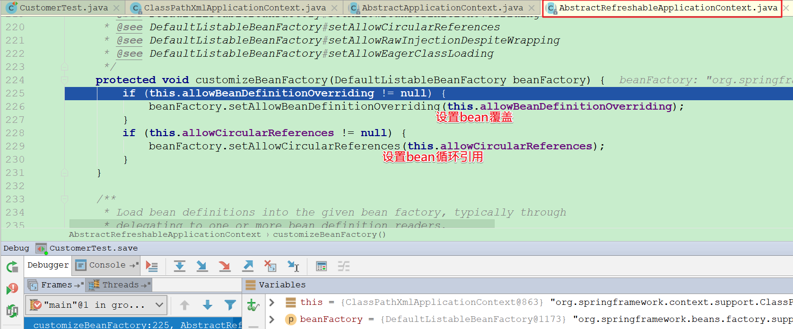
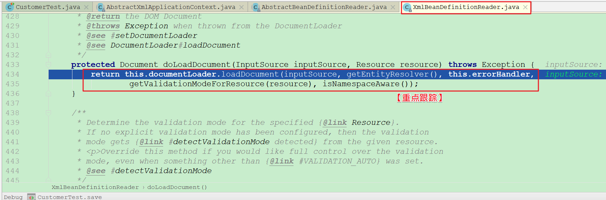

## 课程目标

目标1: 掌握spring框架ioc的工厂体系结构

目标2: 理解spring框架ioc的工厂体系结构设计原理

目标3: 掌握spring框架ioc容器的构建流程

目标4: 掌握spring框架相关的常见面试题


## 01、Spring：准备应用案例

需求说明: 搭建一个简单的spring ioc模块，用于分析 **ioc容器创建流程**与**bean初始化流程**。

**操作步骤**

+ 创建模块(spring-demo)

  

+ 配置pom.xml

  ```xml
  <?xml version="1.0" encoding="UTF-8"?>
  <project xmlns="http://maven.apache.org/POM/4.0.0"
           xmlns:xsi="http://www.w3.org/2001/XMLSchema-instance"
           xsi:schemaLocation="http://maven.apache.org/POM/4.0.0
           http://maven.apache.org/xsd/maven-4.0.0.xsd">
      <modelVersion>4.0.0</modelVersion>
  
      <groupId>cn.itcast</groupId>
      <artifactId>spring-demo</artifactId>
      <version>1.0-SNAPSHOT</version>
  
      <dependencies>
          <!-- 配置spring-context -->
          <dependency>
              <groupId>org.springframework</groupId>
              <artifactId>spring-context</artifactId>
              <version>5.1.8.RELEASE</version>
          </dependency>
          <!-- 配置junit -->
          <dependency>
              <groupId>junit</groupId>
              <artifactId>junit</artifactId>
              <version>4.12</version>
              <scope>test</scope>
          </dependency>
      </dependencies>
      
  </project>
  ```

+ 编写数据访问接口: cn.itcast.dao.CustomerDao.java

  ```java
  package cn.itcast.dao;
  
  /**
   * 客户Dao接口
   */
  public interface CustomerDao {
  
      // 保存客户
      void saveCustomer();
  }
  ```

+ 编写数据访问接口实现类: cn.itcast.dao.impl.CustomerDaoImpl.java

  ```java
  package cn.itcast.dao.impl;
  import cn.itcast.dao.CustomerDao;
  
  /**
   * 客户dao实现类
   */
  public class CustomerDaoImpl implements CustomerDao {
  
      // 保存客户
      public void saveCustomer() {
          System.out.println("正在保存客户操作......");
      }
  }
  ```

+ 编写业务层接口: cn.itcast.service.CustomerService.java

  ```java
  package cn.itcast.service;
  
  /**
   * 客户service接口
   */
  public interface CustomerService {
  
      // 保存客户
      void saveCustomer();
  }
  ```

+ 编写业务层接口实现类: cn.itcast.service.impl.CustomerServiceImpl.java

  ```java
  package cn.itcast.service.impl;
  
  import cn.itcast.dao.CustomerDao;
  import cn.itcast.service.CustomerService;
  
  /**
   * 客户service实现类
   */
  public class CustomerServiceImpl implements CustomerService {
      // 注入客户数据访问接口
      private CustomerDao customerDao;
  
      // 保存客户
      public void saveCustomer() {
          customerDao.saveCustomer();
      }
  
      // setter方法(用spring的设值注入)
      public void setCustomerDao(CustomerDao customerDao) {
          this.customerDao = customerDao;
      }
  }
  ```

+ 编写bean.xml: src/main/resources/bean.xml

  ```xml
  <?xml version="1.0" encoding="UTF-8"?>
  <beans xmlns="http://www.springframework.org/schema/beans"
         xmlns:xsi="http://www.w3.org/2001/XMLSchema-instance"
         xsi:schemaLocation="http://www.springframework.org/schema/beans
         http://www.springframework.org/schema/beans/spring-beans.xsd">
  
      <!-- 配置客户service-->
      <bean id="customerService" class="cn.itcast.service.impl.CustomerServiceImpl">
          <!-- 设值注入客户dao -->
          <property name="customerDao" ref="customerDao"/>
      </bean>
  
      <!-- 配置客户dao -->
      <bean id="customerDao" class="cn.itcast.dao.impl.CustomerDaoImpl"/>
  
  </beans>
  ```

+ 编写测试类: cn.itcast.CustomerTest.java

  ```java
  package cn.itcast;
  
  import cn.itcast.service.CustomerService;
  import org.junit.Test;
  import org.springframework.context.ApplicationContext;
  import org.springframework.context.support.ClassPathXmlApplicationContext;
  
  /**
   * 客户测试类
   */
  public class CustomerTest {
  
      @Test
      public void save(){
          // 1. 加载spring配置文件，初始化ioc容器
          ApplicationContext ac = new ClassPathXmlApplicationContext("bean.xml");
          // 2. 从ioc容器中获取bean
          CustomerService customerService = (CustomerService) ac.getBean("customerService");
  
          // 3. 保存客户
          customerService.saveCustomer();
      }
  }
  ```

  

## 02、Spring：工厂体系架构

#### 2.1 继承关系

+ ApplicationContext接口继承了8个接口:

   

   

  

  

+ ApplicationContext接口有12个子类:

   

   

  

+ ClassPathXmlApplicationContext初始化Spring ioc容器类:

   

  

#### 2.2 设计原理

> Spring框架中的工厂体系结构中，ApplicationContext并不是顶层接口，顶层工厂接口是BeanFactory。

 

| 名称                                  | 描述                                                         |
| ------------------------------------- | ------------------------------------------------------------ |
| BeanFactory                           | 【重点】spring框架工厂体系结构的顶层接口，提供了基础规范：获取bean对象、bean的作用范围、bean的类型。 |
| ListableBeanFactory                   | BeanFactory接口中的getBean方法只能获取单个对象。ListableBeanFactory可以获取多个对象 |
| HierarchicalBeanFactory               | 在一个spring应用中，支持有多个BeanFactory，并且可以设置为它们的父子关系。比如ssm框架整合中的两个ioc容器 |
| ApplicationContext                    | 【重点】项目中直接使用的工厂接口，它同时继承了ListableBeanFactory和HierarchicalBeanFactory接口 |
| AbstractApplicationContext            | 【重点】ApplicationContext工厂抽象类，提供了ioc容器初始化公共实现 |
| AbstractRefreshableApplicationContext | 在AbstractApplicationContext基础上，增加了ioc容器重建支持    |
| AbstractXmlApplicationContext         | 增加了配置文件解析处理                                       |
| ClassPathXmlApplicationContext        | 【重点】项目中，直接使用的工厂实现类。从类的根路径下加载配置文件，创建spring ioc容器 |
| DefaultListableBeanFactory            | 【重点】在spring框架工厂体系结构中，它是最强大的工厂类，也是我们最终创建的ioc容器，它内部持有了一系列Map集合。 |

说明: 刚才我们看到在Spring框架中，从顶层工厂接口BeanFactory开始，提供了多个分支子接口。在每个分支子接口下，又有多个不同的实现类。我们可能会在想？为什么Spring框架针对工厂，为什么要设计如此多的接口和实现类？它的用意是什么？

Spring工厂体系设计原理:

```txt
Spring框架需要满足高扩展性，需要满足适应各种使用场景。比如: xml配置方式支持、注解配置方式支持、国际化支持、C/S项目初始化ioc容器支持、web项目初始化ioc容器支持、不同方式加载资源文件支持等等。
所以划分了很多不同的接口(规范,各施其责)，很多不同的抽像类(实现一部分方法)、很多不同的实现类。
```


## 03、Spring：核心模块解析

 

Spring框架主要包含了五大核心模块:

+ **Core Container(核心容器)**
  + spring-core: Spring中的核心工具类包。
  + spring-beans: Spring中定义bean的组件。
  + spring-context: Spring的运行容器。
  + spring-context-support: Spring容器的扩展支持。
  + spring-expression: Spring的表达式语言支持(SpEL)。
+ **AOP(面向切面编程)** 
  + spring-aop：基于代理的AOP支持。
  + spring-aspects：集成Aspects的AOP支持。
+ **WEB(MVC)** 
  + spring-web：提供web的基础功能。
  + spring-webmvc：提供springmvc的功能。
  + spring-websocket：提供web socket支持。
  + spring-webmvc-portlet：提供Portlet环境的支持。
+ **Data Access/Integration(数据访问/集成)** 
  + spring-jdbc：提供对jdbc连接的封装功能。
  + spring-tx：提供对事务的支持。
  + spring-orm：提供对象－关系映射支持。
  + spring-oxm：提供对象－XML映射支持。
  + spring-jms：提供消息队列的支持。
+ **Test(测试)** 
  + spring-test：提供对测试功能的支持。 


## == Spring IoC初始化源码分析 ==

```shell
# 关于ioc知识点回顾：
IoC(Inversion of Control)控制反转。在spring框架中，IoC是spring框架用于创建对象和管理对象的容器。它就是一个Map。
key : bean的id
value: BeanDefinition(包含了该<bean/>标签全部信息)
```

## 04、Spring：创建容器主体流程

#### 4.1 源码时序图

 

```shell
#### 流程描述 ####
1.从项目应用中的使用入口：
  ApplicationContext ac = new ClassPathXmlApplicationContext("bean.xml");
		
2.找到工厂实现类【ClassPathXmlApplicationContext】中对应的构造方法，执行ioc容器初始化：
   public ClassPathXmlApplicationContext(String[] configLocations, boolean refresh, 
           @Nullable ApplicationContext parent) throws BeansException {
             ................................
   }
		 
3.找到工厂抽象父类【AbstractApplicationContext】中的【refresh】方法：
  3.1.该方法实现解析xml配置文件内容，封装成BeanDefinition对象，注册到BeanFactory中
  3.2.该方法实现一些基础组件的注册：bean后置处理器组件、监听器组件、国际化资源组件
  3.3.该方法实现bean对象的真正实例化。细节：初始化全部【singleton】单例对象，标记为【lazy-init】
      延迟加载的对象除外
```

#### 4.2 核心源码分析

【ClassPathXmlApplicationContext.java】

```java
public class ClassPathXmlApplicationContext extends AbstractXmlApplicationContext {
     
    // 资源配置文件成员变量，是一个数组，支持多个spring的配置文件
     @Nullable
    private Resource[] configResources;

     // 默认构造方法
    public ClassPathXmlApplicationContext() {
    }

    // 如果已经存在一个ioc容器，可以在构造的时候设置【父】容器
    public ClassPathXmlApplicationContext(ApplicationContext parent) {
        super(parent);
    }

     // 1. 【重点跟踪】根据xxx.xml配置文件，创建ioc容器
    public ClassPathXmlApplicationContext(String configLocation)throws BeansException {
        this(new String[]{configLocation}, true, (ApplicationContext)null);
    }

    ..........................................

   /**
    * 2. 【重点跟踪】方法说明：
    *	根据xml文件的定义，以及父容器，创建一个新的ClassPathXmlApplicationContext
    *
    *参数说明：
    *	configLocations：xml配置文件数组
    *	refresh：是否要重新创建ioc容器。加载全部bean的定义和创建所有的单例对象
    *	parent：父容器
    */
    public ClassPathXmlApplicationContext(String[] configLocations, boolean refresh, 
                  @Nullable ApplicationContext parent) throws BeansException {
        super(parent);// 设置父容器
    
        // 根据提供的路径，处理成配置文件数组(以分号、逗号、空格、tab、换行符分割)
        this.setConfigLocations(configLocations);
        if (refresh) {
            this.refresh();// 3. 【核心方法】：该方法表示初始化（或者重建）ioc容器。即可以把原
                           // 来的ApplicationContext销毁，重新执行初始化创建
        }
    }
    ..........................................
}
```

【AbstractApplicationContext.java】

```java
public abstract class AbstractApplicationContext extends DefaultResourceLoader implements ConfigurableApplicationContext {
     ..........................................
     /**
     * 4.【重点跟踪】方法说明：
     *	【核心方法】：该方法表示初始化（或者重建）ioc容器。即可以把原来的
     *   ApplicationContext销毁，重新执行初始化创建 
     */
    public void refresh() throws BeansException, IllegalStateException {
      
       // 创建ioc容器，同步加锁，保障线程安全
       synchronized (this.startupShutdownMonitor) {
			// 预备工作：记录容器启动的时间 和 容器激活状态
			prepareRefresh();

			// 【关键步骤】 获取新的bean工厂(obtainFreshBeanFactory)
           	 //	1.根据配置文件中的内容，解析成一个个Bean定义实例（BeanDefinition）
             //	2.将一个个Bean定义实例，注册到BeanFactory中
           	 // 3.细节：此时还没有真正创建对应的bean对象
			ConfigurableListableBeanFactory beanFactory = obtainFreshBeanFactory();

			// 为BeanFactory设置其它信息:
           	 // 1.设置bean类加载器
             // 2.设置Bean表达式解析器
           	 // 3.设置BeanPostProcessor（bean后置处理器）
           	 // 4.设置资源加载器
             // ....
			prepareBeanFactory(beanFactory);

			try {
				// 设置BeanFactoryPostProcessors(预留方法)
				postProcessBeanFactory(beanFactory);

			    // 调用BeanFactoryPostProcessor各个实现类的 
                 // postProcessBeanFactory(factory) 方法
                 // 可以理解为是给BeanFactory提供的一种扩展机制。比如可以让我们的
                 // BeanFactory实现BeanFactoryPostProcessor接口，增强该BeanFactory的功能
				invokeBeanFactoryPostProcessors(beanFactory);

				// 注册BeanPostProcessor的实现类：
                  // 1.该接口有两个方法：
                  // postProcessBeforeInitialization(), 在init-method属性指定的方法前调用
                  // postProcessAfterInitialization(),  在init-method属性指定的方法后调用
				registerBeanPostProcessors(beanFactory);

				// 初始化国际化支持的资源文件
				initMessageSource();

				// 初始化ApplicationContext事件广播器
				initApplicationEventMulticaster();

				// 模板方法：用于特殊bean的初始化，默认是空实现（在api中如果预留了一些方法
                 // 实现是空，表示该方法是留给子类自我实现。那么这些方法称为：钩子方法）
				onRefresh();

				// 注册事件监听器：监听器需要实现ApplicationListener接口
				registerListeners();

                  // 【关键步骤】实例化所有非延迟加载的单例bean对象
                  // <bean id="customerDao" class="com.itcast.dao.impl.CustomerDaoImpl" 
                  //     lazy-init="false" scope="singleton"/>
				finishBeanFactoryInitialization(beanFactory);
                
                  // 发布广播事件。ApplicationContext初始化完成
				finishRefresh();
			}catch (BeansException ex) {
				if (logger.isWarnEnabled()) {
					logger.warn("Exception encountered during context initialization 
                                   - " + "cancelling refresh attempt: " + ex);
				}

                 // 如果发生异常，需要销毁已经创建的singleton对象
				destroyBeans();

                  // 将active状态设置为false
				cancelRefresh(ex);

				// Propagate exception to caller.
				throw ex;
			}finally {
				// Reset common introspection caches in Spring's core, since we
				// might not ever need metadata for singleton beans anymore...
				resetCommonCaches();
			}
		}
    }  
    ..........................................   
}
```

#### 4.3 源码debug

+ 第一步：

    

+ 第二步:

    

+ 第三步:

    

+ 第四步:

    

+ 第五步:

    

#### 4.4 流程小结

```shell
#### 小结 ####
1.在应用程序中，通过调用ClassPathXmlApplicationContext工厂实现类构造方法，初始化创建ioc容器入口
	
2.在ClassPathXmlApplicationContext构造方法中，调用refresh方法：
  2.1.方法名称很特别，不是init，而是refresh。refresh表示不仅仅是初始化创建ioc容器，
      还有可能是已经有了一个ioc容器，需要更新的意思。
  2.2.spring框架在处理过程中，会考虑先释放已经存在的ioc容器，再重新创建一个新的ioc容器
	
3.Spring框架允许在一个应用中，可以存在多个ioc容器，并且可以建立它们之间的父子关系。
  比如在ssm框架整合中，就有两个ioc容器:
  3.1.通过ContextLoaderListener监听器，加载spring配置文件，创建的父容器
  3.2.通过DispatcherServlet前端控制器，加载springmvc主配置文件，创建的子容器
	
4.Spring框架在创建ioc容器时，主体流程:
  4.1.设置容器的初始化状态。比如容器的启动时间，容器的激活状态。
  4.2.【重点】解析bean.xml配置文件，将xml配置文件中的信息，
      比如<bean id="" class=""/>标签的配置信息，解析封装成BeanDefinition对象
  4.3.将BeanDefinition对象，注册到BeanFactory容器中。
      需要注意：此时还没有创建真正的bean对象，只是解析封装xml配置文件内容
  4.4.设置一些公共资源。比如bean的后置处理器、类加载器、监听器、国际化资源等
  4.5.【重点】根据BeanDefinition对象，真正创建bean对象。
      需要注意：此时创建的全部是非延迟加载的单例【singleton】。(lazy-init=false)
  4.6.最后一步广播事件，进行善后处理。
```

重点流程图:

 

Bean定义信息存储:

 

 

Bean对象存储(单例):

 

**注意：Spring ioc容器是如何存储bean?**

```txt
第一个部分: bean定义信息如何存储?
    它是用DefaultListableBeanFactory工厂中的 beanDefinitionMap 存储的。
    beanDefinitionMap是一个Map集合，格式:
    Map<String, BeanDefinition> beanDefinitionMap;
    - key: bean的id或bean的名称
    - value: BeanDefinition(GenericBeanDefinition实现类)
    GenericBeanDefinition: 封装了<bean/>标签解析出来的所有信息。
  
第二个部分: 单例bean如何存储?
    它是用DefaultListableBeanFactory工厂中的 singletonObjects 存储的。
    singletonObjects是一个Map集合，格式:
    Map<String, Object> singletonObjects;
    - key: bean的id或bean的名称
    - value: bean对象
```


## == refresh方法源码分析 ==

## 05、Spring：创建容器预备工作【了解】

  

【AbstractApplicationContext-prepareRefresh】

```java
/**
 * 方法说明：创建bean容器前的预备工作
 * 1.设置容器启动时间
 * 2.设置closed状态
 * 3.设置active状态
 */
protected void prepareRefresh() {
	// 容器启动时间（当前系统时间）
	this.startupDate = System.currentTimeMillis();
	// closed状态，false表示容器不是关闭状态
	this.closed.set(false);
	// active状态,true表示容器是激活状态
	this.active.set(true);

	if (logger.isInfoEnabled()) {
		logger.info("Refreshing " + this);
	}

	// 初始化加载属性资源文件。该方法是空实现，留给子类实现特殊处理
	initPropertySources();

	// 准备校验系统环境属性资源。比如使用@Value注解中系统环境中取值：
	// @Value("${jdbc.driver}")
	getEnvironment().validateRequiredProperties();

	// 初始化早期应用的事件集合，它是一个Set
	this.earlyApplicationEvents = new LinkedHashSet<>();
}
```

## 06、Spring：创建Bean容器

#### 6.1 源码时序图

 

```shell
#### 流程描述 ####
1.调用【AbstractApplicationContext】refresh()方法:
	初始化创建Bean容器入口
		
2.调用【AbstractApplicationContext】obtainFreshBeanFactory()方法:
	
3.调用【AbstractRefreshableApplicationContext】refreshBeanFactory()方法:
	创建Bean容器，加载并注册bean
		
4.调用【AbstractRefreshableApplicationContext】customizeBeanFactory()方法：
  4.1.设置bean覆盖。如果在配置文件中通过bean标签配置时，有id或者name属性值相同的bean标签配置。
      spring框架默认在同一个配置文件中出现重复，则报错。在不同配置文件中出现，则进行覆盖
  4.2.设置bean循环引用。循环引用是指：A依赖B、B依赖C、C依赖A
		
5.调用【AbstractXmlApplicationContext】loadBeanDefinitions()方法：
	加载解析xxx.xml配置文件，根据xml配置文件内容，将bean标签的定义，解析成BeanDefinition实例。
	并且注册到beanFactory中。
    	
6.调用【AbstractRefreshableApplicationContext】getBeanFactory()方法：
	返回Bean容器
```

#### 6.2 核心源码分析

【AbstractApplicationContext-obtainFreshBeanFactory】

```java
/**
 * Tell the subclass to refresh the internal bean factory.
 * @return the fresh BeanFactory instance
 * @see #refreshBeanFactory()
 * @see #getBeanFactory()
 */
protected ConfigurableListableBeanFactory obtainFreshBeanFactory() {
    // 【重点跟踪】创建Bean容器，加载并且注册bean
    refreshBeanFactory();
    // 获取beanFactory对象
    return getBeanFactory();
}   
```

【AbstractRefreshableApplicationContext-refreshBeanFactory】

```java
/**
 * This implementation performs an actual refresh of this context's underlying
 * bean factory, shutting down the previous bean factory (if any) and
 * initializing a fresh bean factory for the next phase of the context's lifecycle.
 * 方法说明：
 *   1 .创建Bean容器，加载并且注册bean
 *   2. 首先关闭上一次创建的bean factory，如果还存在的话
 *   3. 初始化创建一个新的bean factory
 */
@Override
protected final void refreshBeanFactory() throws BeansException {
    // 判断是否存在bean factory，如果存在需要执行释放操作
    if (hasBeanFactory()) {
        // 销毁容器中管理的全部bean对象
        destroyBeans();
        // 销毁当前Bean容器
        closeBeanFactory();
    }

    try {
        // 创建一个新的Bean容器
        DefaultListableBeanFactory beanFactory = createBeanFactory();
        // 设置序列化id
        beanFactory.setSerializationId(getId());
        // 【重点跟踪】定制beanFactory
        // 1.设置bean覆盖。如果在配置文件中通过bean标签配置时，有id或者name属性值相同的bean标签配置。spring框架默认在同一个配置文件中出现重复，则报错。在不同配置文件中出现，则进行覆盖
        // 2.设置bean循环引用。循环引用是指：A依赖B、B依赖C、C依赖A
        customizeBeanFactory(beanFactory);
        // 【重点跟踪】加载解析xxx.xml配置文件，根据xml配置文件内容，将bean标签的定义，解析成BeanDefinition实例。并且注册到beanFactory中
        loadBeanDefinitions(beanFactory);
        
        synchronized (this.beanFactoryMonitor) {
            this.beanFactory = beanFactory;
        }
    }
    catch (IOException ex) {
        throw new ApplicationContextException("I/O error parsing bean definition source for " + getDisplayName(), ex);
    }
}
```

【AbstractRefreshableApplicationContext-customizeBeanFactory】

```java
/**
* 定制beanFactory
*/
protected void customizeBeanFactory(DefaultListableBeanFactory beanFactory) {
    // 1.设置bean覆盖。如果在配置文件中通过bean标签配置时，有id或者name属性值相同的bean标签配置。spring框架默认在同一个配置文件中出现重复，则报错。在不同配置文件中出现，则进行覆盖
    if (this.allowBeanDefinitionOverriding != null) {
        beanFactory.setAllowBeanDefinitionOverriding(this.allowBeanDefinitionOverriding);
    }
    // 2.设置bean循环引用。循环引用是指：A依赖B、B依赖C、C依赖A
    if (this.allowCircularReferences != null) {
        beanFactory.setAllowCircularReferences(this.allowCircularReferences);
    }
}
```

【AbstractXmlApplicationContext-loadBeanDefinitions】

```java
/**
 * Loads the bean definitions via an XmlBeanDefinitionReader.
 * @see org.springframework.beans.factory.xml.XmlBeanDefinitionReader
 * @see #initBeanDefinitionReader
 * @see #loadBeanDefinitions
 * 方法说明：
 *   通过xml配置文件，读取解析内容，封装到BeanDefinition中。
 */
@Override
protected void loadBeanDefinitions(DefaultListableBeanFactory beanFactory) throws BeansException, IOException {
    // 为指定的BeanFactory创建新的XmlBeanDefinitionReader
    XmlBeanDefinitionReader beanDefinitionReader = 
               new XmlBeanDefinitionReader(beanFactory);
    
    // 设置环境、资源加载器、实体解析器
    beanDefinitionReader.setEnvironment(this.getEnvironment());
    beanDefinitionReader.setResourceLoader(this);
    beanDefinitionReader.setEntityResolver(new ResourceEntityResolver(this));

    // 初始化bean定义需要的读取流
    initBeanDefinitionReader(beanDefinitionReader);
    // 【重点跟踪】加载bean的定义 (该行代码是关键)
    loadBeanDefinitions(beanDefinitionReader);
}
```

  

  

【AbstractRefreshableApplicationContext-getBeanFactory】

```java
// 返回beanFactory
public final ConfigurableListableBeanFactory getBeanFactory() {
  synchronized (this.beanFactoryMonitor) {
    if (this.beanFactory == null) {
       throw new IllegalStateException("BeanFactory not initialized or already closed - " 
          + "call 'refresh' before accessing beans via the ApplicationContext");
       }
       return this.beanFactory;
   }
}
```

#### 6.3 源码debug

+ 第一步:

    

+ 第二步:

     

+ 第三步:

     

+ 第四步:

     

+ 第五步: 

    

+ 第六步:

    

+ 第七步:

    

+ 第八步:

    

+ 第九步:

     

+ 第十步:

     


## 07、Spring：解析xml文件流程【了解】

#### 7.1 源码时序图

第一部分:

 

第二部分:

 

```shell
#### 流程描述 ####
1.调用【AbstractBeanDefinitionReader】loadBeanDefinitions方法：
	解析xml文档入口
		
2.调用【XmlBeanDefinitionReader】loadBeanDefinitions方法：
	加载xml配置文件内容，获取InputStream流对象

3.调用【XmlBeanDefinitionReader】doLoadBeanDefinitions方法：
	根据InputStream流，获取Document文档对象
		
4.调用【DefaultDocumentLoader】loadDocument方法：
	工具类，通过DocumentBuilder构建器，将InputStream流，转换成Document文档对象
		
5.调用【XmlBeanDefinitionReader】registerBeanDefinitions方法：
	根据Document文档对象，完成解析成BeanDefinition对象
		
6.调用【DefaultBeanDefinitionDocumentReader】registerBeanDefinitions方法：
	从Document文档根元素开始解析，转换成BeanDefinition对象
		
7.调用【DefaultBeanDefinitionDocumentReader】doRegisterBeanDefinitions方法：
	从根元素root开始解析，注册每一个BeanDefinition对象
		
8.调用【DefaultBeanDefinitionDocumentReader】parseBeanDefinitions方法：
	解析beans根标签的的具体子标签。比如：bean/alias/import
		
9.调用【DefaultBeanDefinitionDocumentReader】parseDefaultElement方法：
	私有方法，解析beans标签的具体子元素标签。比如<bean/>、<import/>等
		
10.调用【BeanDefinitionParserDelegate】parseBeanDefinitionElement方法：
	解析<bean id="" class=""/>标签。转换成BeanDefinition对象
		
11.调用【DefaultBeanDefinitionDocumentReader】processBeanDefinition方法：
	将BeanDefinition对象，注册到BeanFactory中
		
12.调用【BeanDefinitionReaderUtils】registerBeanDefinition方法：
	将BeanDefinition对象，注册到BeanDefinitionRegistry中。此处的BeanDefinitionRegistry就是BeanFactory容器
```


#### 7.2 基础源码分析

```shell
#### 描述 ####
通过完成xml配置文件解析，将xml中的<bean>标签配置内容，转换成BeanDefinition对象，并且注册到BeanFactory中。关于解析xml和BeanDefinition对象，主要有以下api：
1. BeanDefinition：
	存储Bean相关信息。比如bean对应的类、是否是单例、是否是延迟加载等
		
2. XmlBeanDefinitionReader：
	加载读取xml配置文件，获取xml对应的Document文档对象
		
3. DefaultBeanDefinitionDocumentReader：
	根据Document文档对象，从根元素开始解析子标签配置（重点是bean标签），转换成对应的
	BeanDefinition对象，注册到BeanFactory
		
4. BeanDefinitionParserDelegate：
	spring的xml配置文件内容，以及BeanDefinition委派类。是人大代表
```

【BeanDefinition】

```java
public interface BeanDefinition extends AttributeAccessor, BeanMetadataElement {

	/** 单例作用范围  */
	String SCOPE_SINGLETON = ConfigurableBeanFactory.SCOPE_SINGLETON;
	/** 多例作用范围 */
	String SCOPE_PROTOTYPE = ConfigurableBeanFactory.SCOPE_PROTOTYPE;
    .................................................
	/** 设置bean类名称 */
	void setBeanClassName(@Nullable String beanClassName);
	/** 获取bean类名称 */
	@Nullable
	String getBeanClassName();
	/** 设置bean作用范围 */
	void setScope(@Nullable String scope);
	/** 获取bean作用范围 */
	@Nullable
	String getScope();
	/** 设置延迟加载 */
	void setLazyInit(boolean lazyInit);
	/** 获取bean是否延迟加载 */
	boolean isLazyInit();
	/** 设置bean的依赖（在bean标签中的depend-on属性） */
	void setDependsOn(@Nullable String... dependsOn);
	/** 获取bean的依赖 */
	@Nullable
	String[] getDependsOn();
    .................................................	
	/** 对于通过工厂方法实例化的bean。设置工厂名称 */
	void setFactoryBeanName(@Nullable String factoryBeanName);
	/** 对于通过工厂方法实例化的bean。获取工厂名称 */
	@Nullable
	String getFactoryBeanName();
	/** 对于通过工厂方法实例化的bean。设置工厂方法名称 */
	void setFactoryMethodName(@Nullable String factoryMethodName);
	/** 对于通过工厂方法实例化的bean。获取工厂方法名称 */
	@Nullable
	String getFactoryMethodName();
	/** 获取构造方法参数（构造方法注入）*/
	ConstructorArgumentValues getConstructorArgumentValues();
	/** set方法注入 */
	MutablePropertyValues getPropertyValues();
	/** 是否是单例 */
	boolean isSingleton();
	/** 是否是多例 */
	boolean isPrototype();
	.................................................	
}
```

【DefaultBeanDefinitionDocumentReader】

```java
public class DefaultBeanDefinitionDocumentReader implements BeanDefinitionDocumentReader {
    
    public static final String BEAN_ELEMENT = BeanDefinitionParserDelegate.BEAN_ELEMENT;
    // 嵌套的beans标签
	public static final String NESTED_BEANS_ELEMENT = "beans";
    // alias标签
	public static final String ALIAS_ELEMENT = "alias";
    // name属性
	public static final String NAME_ATTRIBUTE = "name";
    // alias属性
	public static final String ALIAS_ATTRIBUTE = "alias";
    // import标签
	public static final String IMPORT_ELEMENT = "import";
    // resource属性
	public static final String RESOURCE_ATTRIBUTE = "resource";
    // profile属性
	public static final String PROFILE_ATTRIBUTE = "profile";
	.......................................... 
}
```

【BeanDefinitionParserDelegate】

```java
public class BeanDefinitionParserDelegate {

	public static final String BEANS_NAMESPACE_URI = "http://www.springframework.org/schema/beans";
	public static final String MULTI_VALUE_ATTRIBUTE_DELIMITERS = ",; ";

	/**
	 * Value of a T/F attribute that represents true.
	 * Anything else represents false. Case seNsItive.
	 */
	public static final String TRUE_VALUE = "true";
	public static final String FALSE_VALUE = "false";
	public static final String DEFAULT_VALUE = "default";
	public static final String DESCRIPTION_ELEMENT = "description";
	public static final String AUTOWIRE_NO_VALUE = "no";
	public static final String AUTOWIRE_BY_NAME_VALUE = "byName";
	public static final String AUTOWIRE_BY_TYPE_VALUE = "byType";
	public static final String AUTOWIRE_CONSTRUCTOR_VALUE = "constructor";
	public static final String AUTOWIRE_AUTODETECT_VALUE = "autodetect";
	public static final String NAME_ATTRIBUTE = "name";
	public static final String BEAN_ELEMENT = "bean";
	public static final String META_ELEMENT = "meta";
	public static final String ID_ATTRIBUTE = "id";
	public static final String PARENT_ATTRIBUTE = "parent";
	public static final String CLASS_ATTRIBUTE = "class";
	public static final String ABSTRACT_ATTRIBUTE = "abstract";
	public static final String SCOPE_ATTRIBUTE = "scope";
	private static final String SINGLETON_ATTRIBUTE = "singleton";
	public static final String LAZY_INIT_ATTRIBUTE = "lazy-init";
	public static final String AUTOWIRE_ATTRIBUTE = "autowire";
	public static final String AUTOWIRE_CANDIDATE_ATTRIBUTE = "autowire-candidate";
	public static final String PRIMARY_ATTRIBUTE = "primary";
	public static final String DEPENDS_ON_ATTRIBUTE = "depends-on";
	public static final String INIT_METHOD_ATTRIBUTE = "init-method";
	public static final String DESTROY_METHOD_ATTRIBUTE = "destroy-method";
	public static final String FACTORY_METHOD_ATTRIBUTE = "factory-method";
	public static final String FACTORY_BEAN_ATTRIBUTE = "factory-bean";
	public static final String CONSTRUCTOR_ARG_ELEMENT = "constructor-arg";
	public static final String INDEX_ATTRIBUTE = "index";
	public static final String TYPE_ATTRIBUTE = "type";
	public static final String VALUE_TYPE_ATTRIBUTE = "value-type";
	public static final String KEY_TYPE_ATTRIBUTE = "key-type";
	public static final String PROPERTY_ELEMENT = "property";
	public static final String REF_ATTRIBUTE = "ref";
	public static final String VALUE_ATTRIBUTE = "value";
	public static final String LOOKUP_METHOD_ELEMENT = "lookup-method";
	public static final String REPLACED_METHOD_ELEMENT = "replaced-method";
	public static final String REPLACER_ATTRIBUTE = "replacer";
	public static final String ARG_TYPE_ELEMENT = "arg-type";
	public static final String ARG_TYPE_MATCH_ATTRIBUTE = "match";
	public static final String REF_ELEMENT = "ref";
	public static final String IDREF_ELEMENT = "idref";
	public static final String BEAN_REF_ATTRIBUTE = "bean";
	public static final String PARENT_REF_ATTRIBUTE = "parent";
	public static final String VALUE_ELEMENT = "value";
	public static final String NULL_ELEMENT = "null";
	public static final String ARRAY_ELEMENT = "array";
	public static final String LIST_ELEMENT = "list";
	public static final String SET_ELEMENT = "set";
	public static final String MAP_ELEMENT = "map";
	public static final String ENTRY_ELEMENT = "entry";
	public static final String KEY_ELEMENT = "key";
	public static final String KEY_ATTRIBUTE = "key";
	public static final String KEY_REF_ATTRIBUTE = "key-ref";
	public static final String VALUE_REF_ATTRIBUTE = "value-ref";
	public static final String PROPS_ELEMENT = "props";
	public static final String PROP_ELEMENT = "prop";
	public static final String MERGE_ATTRIBUTE = "merge";
	public static final String QUALIFIER_ELEMENT = "qualifier";
	public static final String QUALIFIER_ATTRIBUTE_ELEMENT = "attribute";
	public static final String DEFAULT_LAZY_INIT_ATTRIBUTE = "default-lazy-init";
	public static final String DEFAULT_MERGE_ATTRIBUTE = "default-merge";
	public static final String DEFAULT_AUTOWIRE_ATTRIBUTE = "default-autowire";
	public static final String DEFAULT_AUTOWIRE_CANDIDATES_ATTRIBUTE = "default-autowire-candidates";
	public static final String DEFAULT_INIT_METHOD_ATTRIBUTE = "default-init-method";
	public static final String DEFAULT_DESTROY_METHOD_ATTRIBUTE = "default-destroy-method";
	................................................
}
```

#### 7.3 核心源码分析

【AbstractXmlApplicationContext-loadBeanDefinitions】

```java
/**
 * 方法说明：【入口方法】
 *	加载xml配置文件
 */
protected void loadBeanDefinitions(XmlBeanDefinitionReader reader) throws BeansException, IOException {
    Resource[] configResources = getConfigResources();
    if (configResources != null) {
        reader.loadBeanDefinitions(configResources);
    }
    String[] configLocations = getConfigLocations();
    if (configLocations != null) {
        reader.loadBeanDefinitions(configLocations);
    }
}
```

【AbstractBeanDefinitionReader-loadBeanDefinitions】

```java
/**
 * 方法说明：
 *	加载xml配置文件，转换BeanDefinition对象，注册到BeanFactory中。
 */
public int loadBeanDefinitions(String... locations) throws BeanDefinitionStoreException {
    Assert.notNull(locations, "Location array must not be null");
    int counter = 0;
    for (String location : locations) {
        //【重点跟踪】
        counter += loadBeanDefinitions(location);
    }
    return counter;
} 
```

```java
// 重载方法 
@Override
public int loadBeanDefinitions(String location) throws BeanDefinitionStoreException {
     //【重点跟踪】
    return loadBeanDefinitions(location, null); 
}
```

````java
// 重载方法
public int loadBeanDefinitions(String location, @Nullable Set<Resource> actualResources) throws BeanDefinitionStoreException {
    ResourceLoader resourceLoader = getResourceLoader();
    if (resourceLoader == null) {
        throw new BeanDefinitionStoreException(
            "Cannot load bean definitions from location [" + location + "]: no ResourceLoader available");
    }

    if (resourceLoader instanceof ResourcePatternResolver) {
        // Resource pattern matching available.
        try {
            Resource[] resources = ((ResourcePatternResolver) resourceLoader).getResources(location);
            // 【重点跟踪】
            int count = loadBeanDefinitions(resources);
            if (actualResources != null) {
                Collections.addAll(actualResources, resources);
            }
            if (logger.isTraceEnabled()) {
                logger.trace("Loaded " + count + " bean definitions from location pattern [" + location + "]");
            }
            return count;
        }
        catch (IOException ex) {
            throw new BeanDefinitionStoreException(
                "Could not resolve bean definition resource pattern [" + location + "]", ex);
        }
    }
    else {
        // Can only load single resources by absolute URL.
        Resource resource = resourceLoader.getResource(location);
        int count = loadBeanDefinitions(resource);
        if (actualResources != null) {
            actualResources.add(resource);
        }
        if (logger.isTraceEnabled()) {
            logger.trace("Loaded " + count + " bean definitions from location [" + location + "]");
        }
        return count;
    }
}
````

```java
// 重载方法
@Override
public int loadBeanDefinitions(Resource... resources) throws BeanDefinitionStoreException {
    Assert.notNull(resources, "Resource array must not be null");
    int count = 0;
    for (Resource resource : resources) {
        // 【重点跟踪】
        count += loadBeanDefinitions(resource);
    }
    return count;
}
```

【XmlBeanDefinitionReader-loadBeanDefinitions】

```java
// 加载bean定义来自xml配置文件
@Override
public int loadBeanDefinitions(Resource resource) throws BeanDefinitionStoreException {
    // 【重点跟踪】
    return loadBeanDefinitions(new EncodedResource(resource));
}
```

```java
/**
 * 重载方法
 * 加载xml配置文件内容，获取InputStream流对象
 */
public int loadBeanDefinitions(EncodedResource encodedResource) throws BeanDefinitionStoreException {
    Assert.notNull(encodedResource, "EncodedResource must not be null");
    if (logger.isInfoEnabled()) {
        logger.info("Loading XML bean definitions from " + encodedResource.getResource());
    }

    Set<EncodedResource> currentResources = this.resourcesCurrentlyBeingLoaded.get();
    if (currentResources == null) {
        currentResources = new HashSet<>(4);
        this.resourcesCurrentlyBeingLoaded.set(currentResources);
    }
    if (!currentResources.add(encodedResource)) {
        throw new BeanDefinitionStoreException(
            "Detected cyclic loading of " + encodedResource + " - check your import definitions!");
    }
    try {
        // 【关键代码】加载xml配置文件，得到InputStream流对象
        InputStream inputStream = encodedResource.getResource().getInputStream();
        try {
            // 将InputStream流对象，封装成InputSource对象
            InputSource inputSource = new InputSource(inputStream);
            if (encodedResource.getEncoding() != null) {
                // 设置字符集编码
                inputSource.setEncoding(encodedResource.getEncoding());
            }
            // 【重点跟踪】真正加载xml配置文件，转换成Document对象 
            return doLoadBeanDefinitions(inputSource, encodedResource.getResource());
        }
        finally {
            // 释放io流资源
            inputStream.close();
        }
    }
    catch (IOException ex) {
        throw new BeanDefinitionStoreException(
            "IOException parsing XML document from " + encodedResource.getResource(), ex);
    }
    finally {
        currentResources.remove(encodedResource);
        if (currentResources.isEmpty()) {
            this.resourcesCurrentlyBeingLoaded.remove();
        }
    }
}
```

【XmlBeanDefinitionReader-doLoadBeanDefinitions】

```java
/**
 * 方法说明：
 * 根据InputStream流，获取Document文档对象
 */
protected int doLoadBeanDefinitions(InputSource inputSource, Resource resource)
    throws BeanDefinitionStoreException {
    try {
        // 【重点跟踪】 根据InputStream流，获取Document文档对象
        Document doc = doLoadDocument(inputSource, resource);
        // 【重点跟踪】根据Document对象内容，注册BeanDefinition对象到BeanFactory
        return registerBeanDefinitions(doc, resource);
    }
    catch (BeanDefinitionStoreException ex) {
        throw ex;
    }
    catch (SAXParseException ex) {
        throw new XmlBeanDefinitionStoreException(resource.getDescription(),
                                                  "Line " + ex.getLineNumber() + " in XML document from " + resource + " is invalid", ex);
    }
    catch (SAXException ex) {
        throw new XmlBeanDefinitionStoreException(resource.getDescription(),
                                                  "XML document from " + resource + " is invalid", ex);
    }
    catch (ParserConfigurationException ex) {
        throw new BeanDefinitionStoreException(resource.getDescription(),
                                               "Parser configuration exception parsing XML from " + resource, ex);
    }
    catch (IOException ex) {
        throw new BeanDefinitionStoreException(resource.getDescription(),
                                               "IOException parsing XML document from " + resource, ex);
    }
    catch (Throwable ex) {
        throw new BeanDefinitionStoreException(resource.getDescription(),
                                               "Unexpected exception parsing XML document from " + resource, ex);
    }
}
```

【XmlBeanDefinitionReader-doLoadDocument】

```java
// 通过SAX解析，得到文档
protected Document doLoadDocument(InputSource inputSource, Resource resource) throws Exception {
    // 【重点跟踪】
    return this.documentLoader.loadDocument(inputSource, getEntityResolver(),         
           this.errorHandler,getValidationModeForResource(resource), isNamespaceAware());
}
```

【DefaultDocumentLoader-loadDocument】具体解析过程不再跟踪

```java
/**
 * Load the {@link Document} at the supplied {@link InputSource}
 * using the standard JAXP-configured
 * XML parser.
 * 方法说明：
 *	工具类，通过DocumentBuilder构建器，将InputStream流，转换成Document文档对象
 */
@Override
public Document loadDocument(InputSource inputSource, EntityResolver entityResolver,
     ErrorHandler errorHandler, int validationMode, boolean namespaceAware) throws Exception {

    DocumentBuilderFactory factory = createDocumentBuilderFactory(validationMode, namespaceAware);
    if (logger.isDebugEnabled()) {
        logger.debug("Using JAXP provider [" + factory.getClass().getName() + "]");
    }
    // 通过DocumentBuilder构建器，解析xml配置文件内容，获取Document文档对象
    DocumentBuilder builder = createDocumentBuilder(factory, entityResolver, errorHandler);
    return builder.parse(inputSource);
}
```

【XmlBeanDefinitionReader-registerBeanDefinitions】

```java
/**
 * 方法说明：
 *  根据Document文档对象，完成解析成BeanDefinition对象
 */
public int registerBeanDefinitions(Document doc, Resource resource) throws BeanDefinitionStoreException {
    BeanDefinitionDocumentReader documentReader = createBeanDefinitionDocumentReader();
    int countBefore = getRegistry().getBeanDefinitionCount();
    // 【重点跟踪】根据Document对象内容，注册BeanDefinition对象到BeanFactory
    documentReader.registerBeanDefinitions(doc, createReaderContext(resource));
    return getRegistry().getBeanDefinitionCount() - countBefore;
}
```

【DefaultBeanDefinitionDocumentReader-registerBeanDefinitions】

```java
/**
 * 方法说明：
 *	从Document文档根元素开始解析，转换成BeanDefinition对象
 */
@Override
public void registerBeanDefinitions(Document doc, XmlReaderContext readerContext) {
    this.readerContext = readerContext;
    // 【重点跟踪】 转换BeanDefinition对象
    doRegisterBeanDefinitions(doc.getDocumentElement());
} 
```

【DefaultBeanDefinitionDocumentReader-doRegisterBeanDefinitions】

```java
/**
 * Register each bean definition within the given root {@code <beans/>} element.
 * 方法说明：
 *	从根元素root开始解析，注册每一个BeanDefinition对象
 */
protected void doRegisterBeanDefinitions(Element root) {
    // 代表spring配置文件中的标签和属性、以及最终转换成的BeanDefinition对象
    BeanDefinitionParserDelegate parent = this.delegate;
    this.delegate = createDelegate(getReaderContext(), root, parent);

    // 此段代码不需要关心
    if (this.delegate.isDefaultNamespace(root)) {
        String profileSpec = root.getAttribute(PROFILE_ATTRIBUTE);
        if (StringUtils.hasText(profileSpec)) {
            String[] specifiedProfiles = StringUtils.tokenizeToStringArray(
                profileSpec, BeanDefinitionParserDelegate.MULTI_VALUE_ATTRIBUTE_DELIMITERS);
            if (!getReaderContext().getEnvironment().acceptsProfiles(specifiedProfiles)) {
                if (logger.isInfoEnabled()) {
                    logger.info("Skipped XML bean definition file due to specified profiles [" + profileSpec +
                                "] not matching: " + getReaderContext().getResource());
                }
                return;
            }
        }
    }

    // 留给子类实现的钩子方法。此时不需要关心
    preProcessXml(root);
    // 【重点跟踪】：从根元素开始，解析配置文件内容
    parseBeanDefinitions(root, this.delegate);
    // 留给子类实现的钩子方法。此时不需要关心
    postProcessXml(root);

    this.delegate = parent;
}
```

【DefaultBeanDefinitionDocumentReader-parseBeanDefinitions】

```java
/**
 * Parse the elements at the root level in the document:
 * "import", "alias", "bean".
 * @param root the DOM root element of the document
 * 方法说明：
 *	解析beans根标签的的具体子标签。比如：bean/alias/import
 */ 
protected void parseBeanDefinitions(Element root, BeanDefinitionParserDelegate delegate) {
    if (delegate.isDefaultNamespace(root)) {
        NodeList nl = root.getChildNodes();
        for (int i = 0; i < nl.getLength(); i++) {
            Node node = nl.item(i);
            if (node instanceof Element) {
                Element ele = (Element) node;
                if (delegate.isDefaultNamespace(ele)) {
                    // 【重点跟踪】解析spring默认提供的配置标签：bean/alias/import
                    parseDefaultElement(ele, delegate);
                }
                else {
                    // 解析自定义标签。此时不需要关心
                    delegate.parseCustomElement(ele);
                }
            }
        }
    }
    else {
        // 解析自定义标签。此时不需要关心
        delegate.parseCustomElement(root);
    }
}
```

【DefaultBeanDefinitionDocumentReader-parseDefaultElement】

```java
/**
 * 方法说明：
 * 私有方法，解析beans标签的具体子元素标签
 */
private void parseDefaultElement(Element ele, BeanDefinitionParserDelegate delegate) {
    if (delegate.nodeNameEquals(ele, IMPORT_ELEMENT)) {
        importBeanDefinitionResource(ele);
    }
    else if (delegate.nodeNameEquals(ele, ALIAS_ELEMENT)) {
        processAliasRegistration(ele);
    }
    // 解析<bean id="" class=""/>标签配置
    else if (delegate.nodeNameEquals(ele, BEAN_ELEMENT)) {
        // 【重点跟踪】
        processBeanDefinition(ele, delegate);
    }
    else if (delegate.nodeNameEquals(ele, NESTED_BEANS_ELEMENT)) {
        doRegisterBeanDefinitions(ele);
    }
}
```

【DefaultBeanDefinitionDocumentReader-processBeanDefinition】

```java
/**
 * Process the given bean element, parsing the bean definition
 * and registering it with the registry.
 * 方法说明：
 * 1. 处理bean元素，解析后封装到BeanDefinition对象
 * 2. 将BeanDefinition对象，注册到BeanFactory中
 */
protected void processBeanDefinition(Element ele, BeanDefinitionParserDelegate delegate) {
    // 【重点跟踪】
    BeanDefinitionHolder bdHolder = delegate.parseBeanDefinitionElement(ele);
    if (bdHolder != null) {
        bdHolder = delegate.decorateBeanDefinitionIfRequired(ele, bdHolder);
        try {
            //【重点跟踪】
            // 通过工具类BeanDefinitionReaderUtils，将BeanDefinition对象，注册到BeanFactory
            BeanDefinitionReaderUtils.registerBeanDefinition(bdHolder, 
                                       getReaderContext().getRegistry());
        }
        catch (BeanDefinitionStoreException ex) {
            getReaderContext().error("Failed to register bean definition with name '" +
                                     bdHolder.getBeanName() + "'", ele, ex);
        }
        // Send registration event.
        getReaderContext().fireComponentRegistered(new BeanComponentDefinition(bdHolder));
    }
}
```

【BeanDefinitionParserDelegate-parseBeanDefinitionElement】

```java
public BeanDefinitionHolder parseBeanDefinitionElement(Element ele) {
    // 【重点跟踪】
    return parseBeanDefinitionElement(ele, null);
}
```

```java
/** 
 * 【具体解析封装过程不再跟踪】
 * Parses the supplied {@code <bean>} element. May return {@code null}
 * if there were errors during parse. Errors are reported to the
 * {@link org.springframework.beans.factory.parsing.ProblemReporter}.
 * 方法说明：
 *	1.解析<bean id="" class=""/>标签配置
 *	2.转换成BeanDefinition对象
 */
@Nullable
public BeanDefinitionHolder parseBeanDefinitionElement(Element ele, @Nullable BeanDefinition containingBean) {
    // id属性
    String id = ele.getAttribute(ID_ATTRIBUTE);
    // name属性
    String nameAttr = ele.getAttribute(NAME_ATTRIBUTE);

    // 别名处理，此时不需要关心
    List<String> aliases = new ArrayList<>();
    if (StringUtils.hasLength(nameAttr)) {
        String[] nameArr = StringUtils.tokenizeToStringArray(nameAttr, MULTI_VALUE_ATTRIBUTE_DELIMITERS);
        aliases.addAll(Arrays.asList(nameArr));
    }

    // 将id属性设置为bean的名称
    String beanName = id;
    if (!StringUtils.hasText(beanName) && !aliases.isEmpty()) {
        beanName = aliases.remove(0);
        if (logger.isDebugEnabled()) {
            logger.debug("No XML 'id' specified - using '" + beanName +
                         "' as bean name and " + aliases + " as aliases");
        }
    }

    // 检查bean名称的唯一性
    if (containingBean == null) {
        checkNameUniqueness(beanName, aliases, ele);
    }

    // 【核心方法】解析bean标签，封装BeanDefinition对象
    AbstractBeanDefinition beanDefinition = parseBeanDefinitionElement(ele, beanName, containingBean);
    if (beanDefinition != null) {
        if (!StringUtils.hasText(beanName)) {
            try {
                if (containingBean != null) {
                    beanName = BeanDefinitionReaderUtils.generateBeanName(
                        beanDefinition, this.readerContext.getRegistry(), true);
                }
                else {
                    beanName = this.readerContext.generateBeanName(beanDefinition);
                    // Register an alias for the plain bean class name, if still possible,
                    // if the generator returned the class name plus a suffix.
                    // This is expected for Spring 1.2/2.0 backwards compatibility.
                    // 获取class属性值
                    String beanClassName = beanDefinition.getBeanClassName();
                    if (beanClassName != null &&
                        beanName.startsWith(beanClassName) 
                        && beanName.length() > beanClassName.length() &&
                        !this.readerContext.getRegistry().isBeanNameInUse(beanClassName)) {
                        aliases.add(beanClassName);
                    }
                }
                if (logger.isDebugEnabled()) {
                    logger.debug("Neither XML 'id' nor 'name' specified - " +
                                 "using generated bean name [" + beanName + "]");
                }
            }
            catch (Exception ex) {
                error(ex.getMessage(), ele);
                return null;
            }
        }
        String[] aliasesArray = StringUtils.toStringArray(aliases);
        // 【核心方法】创建BeanDefinitionHolder对象并返回。这里的BeanDefinitionHolder代表
        // BeanDefinition对象
        return new BeanDefinitionHolder(beanDefinition, beanName, aliasesArray);
    }
    return null;
}
```

【BeanDefinitionReaderUtils-registerBeanDefinition】具体注册过程不再跟踪

```java
/**
 * Register the given bean definition with the given bean factory.
 * @param definitionHolder the bean definition including name and aliases
 * @param registry the bean factory to register with
 * @throws BeanDefinitionStoreException if registration failed
 * 方法说明：
 * 1.将BeanDefinition对象，注册到BeanDefinitionRegistry中
 * 2.这里的BeanDefinitionRegistry，其实就是DefaultListableBeanFactory容器
 */
public static void registerBeanDefinition(
    BeanDefinitionHolder definitionHolder, BeanDefinitionRegistry registry)
    throws BeanDefinitionStoreException {

    // Register bean definition under primary name.
    String beanName = definitionHolder.getBeanName();
    // 将BeanDefinition对象，注册到BeanFactory中。它是一个Map。
    // key==beanName；value=BeanDefinition
    registry.registerBeanDefinition(beanName, definitionHolder.getBeanDefinition());

    // Register aliases for bean name, if any.
    String[] aliases = definitionHolder.getAliases();
    if (aliases != null) {
        for (String alias : aliases) {
            registry.registerAlias(beanName, alias);
        }
    }
}
```


#### 7.4 源码debug

+ 第一步：

    

+ 第二步： 

  

    

  调用重载方法:

   

  调用重载方法:

   

  调用重载方法:

   

+ 第三步：

   

  调用重载方法:

    

+ 第四步：

    

+ 第五步：

   

   

  **说明: 具体创建细节不在跟踪。**

+ 第六步：

    

+ 第七步：

    

+ 第八步：

    

+ 第九步:

    

+ 第十步：

    

+ 第十一步：

   

+ 第十二步:

   

  调用重载方法:

   

+ 第十三步：

  

    

+ 第十四步：

    

#### 7.5 流程小结

```shell
#### 小结 ####
1.解析bean.xml配置文件，获取配置文件内。
 	<bean id="customerService" class="cn.itcast.service.impl.CustomerServiceImpl"/>
 	
2.将配置文件内容中，重点关注bean标签的配置。将bean标签的配置信息，封装成BeanDefinition对象。

3.将BeanDefinition对象，注册到BeanFactory容器中。

注意: 
  到此处仅仅只是封装了xml配置文件信息到BeanDefinition中，还没有真正创建相关的bean对象
  在实现过程中，spring框架提供了一系列的api和api方法，实现过程比较复杂:
  这里大家可能会有一个疑问，不就是解析xml配置文件吗？为什么要这么复杂呢？
  答案: spring框架设计很多api方法，是让一个方法只做一件事情，
        满足【单一职责】的设计原则。目的还是为了解耦。
```


## 08、Spring：创建单例bean【了解】

```shell
#### 描述 ####
到这一步，已经完成了spring配置文件的解析，将相关的配置信息封装成了BeanDefinition对象，同时将BeanDefinition对象，注册到了BeanFactory中。
需要注意：真正的Bean实例对象还没有创建，接下来重点关注，创建实例化bean的流程:
  reflush()方法:  finishBeanFactoryInitialization(beanFactory);
```

#### 8.1 源码时序图

第一部分：


第二部分：


```shell
#### 流程描述 ####
1.调用【AbstractApplicationContext】finishBeanFactoryInitialization方法：
	初始化创建全部单例【singleton】对象的入口方法
		
2.调用【DefaultListableBeanFactory】preInstantiateSingletons方法：
	循环遍历创建所有（非抽象、非延迟加载、是单例）的bean对象入口方法
		
3.调用【AbstractBeanFactory】getBean方法：
	直接调用本类中的doGetBean方法
	
4.调用【AbstractBeanFactory】doGetBean方法：
	从容器中获取目标bean。如果目标bean已经存在，直接获取返回；如果目标bean不存在，则创建目标bean
	
5.调用【AbstractAutowireCapableBeanFactory】createBean方法：
	加载目标bean字节码Class，创建bean对象
	
6.调用【AbstractAutowireCapableBeanFactory】doCreateBean方法：
	实例化bean，设置依赖注入，进行后置回调处理
	
7.调用【AbstractAutowireCapableBeanFactory】createBeanInstance方法：
	通过三种实例化bean方式实例化（工厂方法、构造方法依赖注入、无参数构造方法）
	
8.调用【AbstractAutowireCapableBeanFactory】instantiateBean方法：
	使用无参数构造方法实例化bean
	
9.调用【SimpleInstantiationStrategy】instantiate方法：
	通过反射技术实例化bean对象
```


#### 8.2 核心源码分析

【AbstractApplicationContext-finishBeanFactoryInitialization】

```java
/**
 * Finish the initialization of this context's bean factory,
 * initializing all remaining singleton beans.
 * 方法说明：
 * 初始化全部剩下的单例【singleton】对象
 */
protected void finishBeanFactoryInitialization(ConfigurableListableBeanFactory beanFactory) {
    // 创建conversionService对象。同学们应该还有印象，这不就是我们在springmvc框架中，
    // 自定义的转换服务配置吗
    if (beanFactory.containsBean(CONVERSION_SERVICE_BEAN_NAME) &&
        beanFactory.isTypeMatch(CONVERSION_SERVICE_BEAN_NAME, ConversionService.class)) {
        beanFactory.setConversionService(
            beanFactory.getBean(CONVERSION_SERVICE_BEAN_NAME, ConversionService.class));
    }

    // 框架内部环境，此处不需要关心
    if (!beanFactory.hasEmbeddedValueResolver()) {
        beanFactory.addEmbeddedValueResolver(strVal -> 
                    getEnvironment().resolvePlaceholders(strVal));
    }

    // 织入第三方模块，此处不需要关心
    String[] weaverAwareNames = beanFactory.
                   getBeanNamesForType(LoadTimeWeaverAware.class, false, false);
    for (String weaverAwareName : weaverAwareNames) {
        getBean(weaverAwareName);
    }

    // 设置不使用临时类加载器，此处不需要关心
    beanFactory.setTempClassLoader(null);

    // 创建对象中，不允许再修改解析配置信息
    beanFactory.freezeConfiguration();

    // 【重点跟踪】 创建全部单例，且非延迟加载的bean对象
    beanFactory.preInstantiateSingletons();
}
```

【DefaultListableBeanFactory-preInstantiateSingletons】

```java
/**
 * 方法说明：
 *	获取全部目标bean对象的名称，循环遍历创建bean对象（创建条件：非抽象、是单例、非延迟加载）
 */
public void preInstantiateSingletons() throws BeansException {
    if (this.logger.isDebugEnabled()) {
        this.logger.debug("Pre-instantiating singletons in " + this);
    }

    // 获取全部要创建的目标bean的名称（在bean.xml文件中配置）
    List<String> beanNames = new ArrayList<>(this.beanDefinitionNames);

    // 循环遍历，创建每一个bean对象
    for (String beanName : beanNames) {
        // 合并父bean中的配置，相当于<bean id="" class="" parent=""/>不需要关心，用的不多
        RootBeanDefinition bd = getMergedLocalBeanDefinition(beanName);
        // 判读对象不是抽象、是单例、不是延迟加载即创建
        if (!bd.isAbstract() && bd.isSingleton() && !bd.isLazyInit()) {
            // 工厂方法实例化bean对象
            if (isFactoryBean(beanName)) {
                final FactoryBean<?> factory = (FactoryBean<?>) 
                    getBean(FACTORY_BEAN_PREFIX + beanName);
                boolean isEagerInit;
                if (System.getSecurityManager() != null && factory instanceof
                    SmartFactoryBean) {
                    isEagerInit = 
                        AccessController.doPrivileged((PrivilegedAction<Boolean>) () ->
                ((SmartFactoryBean<?>) factory).isEagerInit(), getAccessControlContext());
                }else {
                    isEagerInit = (factory instanceof SmartFactoryBean &&
                                   ((SmartFactoryBean<?>) factory).isEagerInit());
                }
                if (isEagerInit) {
                    getBean(beanName);
                }
            }else {
                // 【重点跟踪】默认调用无参数构造方法实例化bean对象
                getBean(beanName);
            }
        }
    }

    // 回调处理实现了SmartInitializingSingleton接口的bean。此处不需要关心
    for (String beanName : beanNames) {
        Object singletonInstance = getSingleton(beanName);
        if (singletonInstance instanceof SmartInitializingSingleton) {
            final SmartInitializingSingleton smartSingleton = 
                             (SmartInitializingSingleton) singletonInstance;
            if (System.getSecurityManager() != null) {
                AccessController.doPrivileged((PrivilegedAction<Object>) () -> {
                    smartSingleton.afterSingletonsInstantiated();
                    return null;
                }, getAccessControlContext());
            }
            else {
                smartSingleton.afterSingletonsInstantiated();
            }
        }
    }
}
```

【AbstractBeanFactory-getBean】

```java
public Object getBean(String name) throws BeansException {
	// 【重点跟踪】 直接调用本类中的doGetBean重载方法
	return doGetBean(name, null, null, false);
}
```

【AbstractBeanFactory-doGetBean】

```java
/**
 * Return an instance, which may be shared or independent, of the specified bean.
 * @param name the name of the bean to retrieve
 * @param requiredType the required type of the bean to retrieve
 * @param args arguments to use when creating a bean instance using explicit arguments
 * (only applied when creating a new instance as opposed to retrieving an existing one)
 * @param typeCheckOnly whether the instance is obtained for a type check,
 * not for actual use
 * @return an instance of the bean
 * @throws BeansException if the bean could not be created
 *
 * 方法说明：
 * 从容器中获取目标bean。如果目标bean已经存在，直接获取返回；如果目标bean不存在，则创建目标bean
 * 处理顺序：
 *	1.先从容器中获取bean，如果bean已经存在，直接返回
 *	2.如果bean不存在；则如果是单例bean，创建单例bean
 *	3.如果bean不存在；则如果是多例bean，创建多例bean
 *	4.如果bean不存在；且既不是单例，也不是多例，则由第三方来实例化
 *	5.最后检查判断目标类型是否匹配；如果匹配，直接返回目标bean对象
 */
@SuppressWarnings("unchecked")
protected <T> T doGetBean(final String name, @Nullable final Class<T> requiredType,
         @Nullable final Object[] args, boolean typeCheckOnly) throws BeansException {

    // 获取目标bean的名称
    final String beanName = transformedBeanName(name);
    // 目标bean对象引用。返回值
    Object bean;

    // Eagerly check singleton cache for manually registered singletons.
    // 检查bean是否已经创建
    Object sharedInstance = getSingleton(beanName);
    if (sharedInstance != null && args == null) {
        if (logger.isDebugEnabled()) {
            if (isSingletonCurrentlyInCreation(beanName)) {
                logger.debug("Returning eagerly cached instance of singleton bean '" 
       			+ beanName 
       +  "' that is not fully initialized yet - a consequence of a circular reference");
            }
            else {
                logger.debug("Returning cached instance of singleton bean '" 
                             + beanName + "'");
            }
        }
        // 进一步处理bean对象：
        // 1.如果是普通的bean，直接获取返回
        // 2.如果FactoryBean（工厂方法实例化bean），则返回工厂方法创建的对象
        bean = getObjectForBeanInstance(sharedInstance, name, beanName, null);
    }

    else {
        // Fail if we're already creating this bean instance:
        // We're assumably within a circular reference.
        if (isPrototypeCurrentlyInCreation(beanName)) {
            throw new BeanCurrentlyInCreationException(beanName);
        }

        // Check if bean definition exists in this factory.
        // 如果在当前容器中没有找到目标bean；那么再到父容器中进行查找，看父容器中是否存在
        BeanFactory parentBeanFactory = getParentBeanFactory();
        if (parentBeanFactory != null && !containsBeanDefinition(beanName)) {
            // Not found -> check parent.
            String nameToLookup = originalBeanName(name);
            if (parentBeanFactory instanceof AbstractBeanFactory) {
                return ((AbstractBeanFactory) parentBeanFactory).doGetBean(
                    nameToLookup, requiredType, args, typeCheckOnly);
            }
            else if (args != null) {
                // Delegation to parent with explicit args.
                return (T) parentBeanFactory.getBean(nameToLookup, args);
            }
            else {
                // No args -> delegate to standard getBean method.
                return parentBeanFactory.getBean(nameToLookup, requiredType);
            }
        }

        // 将目标bean放入一个已经创建的Set集合中
        if (!typeCheckOnly) {
            markBeanAsCreated(beanName);
        }

        // 如果前面的步骤，没有找到目标bean，则准备创建
        try {
            final RootBeanDefinition mbd = getMergedLocalBeanDefinition(beanName);
            checkMergedBeanDefinition(mbd, beanName, args);

            // Guarantee initialization of beans that the current bean depends on.
            // 优先初始化被依赖的bean。即通过depends-on属性定义指定的bean
            String[] dependsOn = mbd.getDependsOn();
            if (dependsOn != null) {
                for (String dep : dependsOn) {
                    if (isDependent(beanName, dep)) {
                        throw new BeanCreationException(
                            mbd.getResourceDescription(), beanName, 
                            "Circular depends-on relationship between '" 
                            + beanName + "' and '" + dep + "'");
                    }
                    registerDependentBean(dep, beanName);
                    getBean(dep);
                }
            }

            // Create bean instance.
            // 创建scope="singleton"的bean（单例）
            if (mbd.isSingleton()) {
                sharedInstance = getSingleton(beanName, () -> {
                    try {
                         // 【重点跟踪】
                        return createBean(beanName, mbd, args);
                    }
                    catch (BeansException ex) {
         // Explicitly remove instance from singleton cache: It might have been put there
         // eagerly by the creation process, to allow for circular reference resolution.
         // Also remove any beans that received a temporary reference to the bean.
                        destroySingleton(beanName);
                        throw ex;
                    }
                });
                bean = getObjectForBeanInstance(sharedInstance, name, beanName, mbd);
            }
            // 创建scope="prototype"的bean（多例）
            else if (mbd.isPrototype()) {
                // It's a prototype -> create a new instance.
                Object prototypeInstance = null;
                try {
                    beforePrototypeCreation(beanName);
                    prototypeInstance = createBean(beanName, mbd, args);
                }
                finally {
                    afterPrototypeCreation(beanName);
                }
                bean = getObjectForBeanInstance(prototypeInstance, name, beanName, mbd);
            }
            // 创建其他bean（既不是单例，也不是多例）。需要由第三方来创建的bean
            else {
                String scopeName = mbd.getScope();
                final Scope scope = this.scopes.get(scopeName);
                if (scope == null) {
                    throw new IllegalStateException("No Scope registered for scope name '" + scopeName + "'");
                }
                try {
                    Object scopedInstance = scope.get(beanName, () -> {
                        beforePrototypeCreation(beanName);
                        try {
                            return createBean(beanName, mbd, args);
                        }
                        finally {
                            afterPrototypeCreation(beanName);
                        }
                    });
                    bean = getObjectForBeanInstance(scopedInstance, name, beanName, mbd);
                }
                catch (IllegalStateException ex) {
                    throw new BeanCreationException(beanName,
     "Scope '" + scopeName + "' is not active for the current thread; consider " +  
   "defining a scoped proxy for this bean if you intend to refer to it from a singleton",
                                                    ex);
                }
            }
        }
        catch (BeansException ex) {
            cleanupAfterBeanCreationFailure(beanName);
            throw ex;
        }
    }

    // Check if required type matches the type of the actual bean instance.
    // 检查bean类型是能够匹配
    if (requiredType != null && !requiredType.isInstance(bean)) {
        try {
            T convertedBean = getTypeConverter().convertIfNecessary(bean, requiredType);
            if (convertedBean == null) {
            	throw new BeanNotOfRequiredTypeException(name, 
                                                         requiredType, bean.getClass());
            }
            return convertedBean;
        }
        catch (TypeMismatchException ex) {
            if (logger.isDebugEnabled()) {
                logger.debug("Failed to convert bean '" + name + "' to required type '" +
                             ClassUtils.getQualifiedName(requiredType) + "'", ex);
            }
            throw new BeanNotOfRequiredTypeException(name, 
                                                     requiredType, bean.getClass());
        }
    }
    // 返回目标bean对象
    return (T) bean;
}
```

【AbstractAutowireCapableBeanFactory-createBean】

```java
/**
 * Central method of this class: creates a bean instance,
 * populates the bean instance, applies post-processors, etc.
 * @see #doCreateBean
 * 方法说明：
 *   创建bean对象入口:
 *	 1.确保目标bean的Class字节码加载
 *	 2.如果目标bean实现了后置处理器接口，则返回代理对象
 *	 3.否则，创建目标bean对象，然后返回
 */
@Override
protected Object createBean(String beanName, RootBeanDefinition mbd, 
                 @Nullable Object[] args) throws BeanCreationException {

    if (logger.isDebugEnabled()) {
        logger.debug("Creating instance of bean '" + beanName + "'");
    }
    RootBeanDefinition mbdToUse = mbd;

    // Make sure bean class is actually resolved at this point, and
    // clone the bean definition in case of a dynamically resolved Class
    // which cannot be stored in the shared merged bean definition.

    // 核心代码: 确保目标bean对象的Class字节码，已经加载
    Class<?> resolvedClass = resolveBeanClass(mbd, beanName);
    if (resolvedClass != null && !mbd.hasBeanClass() && mbd.getBeanClassName() != null) {
        mbdToUse = new RootBeanDefinition(mbd);
        mbdToUse.setBeanClass(resolvedClass);
    }

    // Prepare method overrides.
    // 方法覆盖。此处不需要关心
    try {
        mbdToUse.prepareMethodOverrides();
    }
    catch (BeanDefinitionValidationException ex) {
        throw new BeanDefinitionStoreException(mbdToUse.getResourceDescription(),
              beanName, "Validation of method overrides failed", ex);
    }

    try {
        // Give BeanPostProcessors a chance to return a proxy instead of the target bean instance.
        // 如果目标bean有后置处理器，返回代理对象
        Object bean = resolveBeforeInstantiation(beanName, mbdToUse);
        if (bean != null) {
            return bean;
        }
    }
    catch (Throwable ex) {
        throw new BeanCreationException(mbdToUse.getResourceDescription(), beanName,
              "BeanPostProcessor before instantiation of bean failed", ex);
    }

    try {
        // 【重点跟踪】 真正创建bean对象的方法
        Object beanInstance = doCreateBean(beanName, mbdToUse, args);
        if (logger.isDebugEnabled()) {
            logger.debug("Finished creating instance of bean '" + beanName + "'");
        }
        return beanInstance;
    }
    catch (BeanCreationException ex) {
        // A previously detected exception with proper bean creation context already...
        throw ex;
    }
    catch (ImplicitlyAppearedSingletonException ex) {
        // An IllegalStateException to be communicated up to DefaultSingletonBeanRegistry...
        throw ex;
    }
    catch (Throwable ex) {
        throw new BeanCreationException(
            mbdToUse.getResourceDescription(), beanName,
               "Unexpected exception during bean creation", ex);
    }
}
```

【AbstractAutowireCapableBeanFactory-doCreateBean】

```java
/**
 * Actually create the specified bean. Pre-creation processing has already happened
 * at this point, e.g. checking {@code postProcessBeforeInstantiation} callbacks.
 * <p>Differentiates between default bean instantiation, use of a
 * factory method, and autowiring a constructor.
 * @param beanName the name of the bean
 * @param mbd the merged bean definition for the bean
 * @param args explicit arguments to use for constructor or factory method invocation
 * @return a new instance of the bean
 * @throws BeanCreationException if the bean could not be created
 * @see #instantiateBean
 * @see #instantiateUsingFactoryMethod
 * @see #autowireConstructor
 * 方法说明：实例化创建bean
 *	1.创建bean实例
 *	2.设置依赖注入，给相关的属性赋值
 *	3.bean后置回调处理。比如init-method属性配置的初始化方法
 */
protected Object doCreateBean(final String beanName, final RootBeanDefinition mbd, 
                  final @Nullable Object[] args) throws BeanCreationException {

    // Instantiate the bean.
    // 这是bean的装饰器对象，相当于包装了bean对象
    BeanWrapper instanceWrapper = null;
    // 如果是单例bean，同时检查是否是FactoryBean
    if (mbd.isSingleton()) {
        instanceWrapper = this.factoryBeanInstanceCache.remove(beanName);
    }
    if (instanceWrapper == null) {
        //【重点跟踪】如果为空说明不是FactoryBean，则实例化普通bean对象
        instanceWrapper = createBeanInstance(beanName, mbd, args);
    }

    // 获取真实的bean对象，和bean的Class字节码
    final Object bean = instanceWrapper.getWrappedInstance();
    Class<?> beanType = instanceWrapper.getWrappedClass();
    if (beanType != NullBean.class) {
        mbd.resolvedTargetType = beanType;
    }

    // Allow post-processors to modify the merged bean definition.
    // 此处内部处理，不需要关心
    synchronized (mbd.postProcessingLock) {
        if (!mbd.postProcessed) {
            try {
                applyMergedBeanDefinitionPostProcessors(mbd, beanType, beanName);
            }
            catch (Throwable ex) {
                throw new BeanCreationException(mbd.getResourceDescription(), beanName,
                     "Post-processing of merged bean definition failed", ex);
            }
            mbd.postProcessed = true;
        }
    }

    // Eagerly cache singletons to be able to resolve circular references
    // even when triggered by lifecycle interfaces like BeanFactoryAware.
    // 处理bean的循环依赖，此处不需要关心
    boolean earlySingletonExposure = (mbd.isSingleton() && this.allowCircularReferences 
            && isSingletonCurrentlyInCreation(beanName));
    if (earlySingletonExposure) {
        if (logger.isDebugEnabled()) {
            logger.debug("Eagerly caching bean '" + beanName +
                         "' to allow for resolving potential circular references");
        }
        addSingletonFactory(beanName, () -> getEarlyBeanReference(beanName, mbd, bean));
    }

    // Initialize the bean instance.
    Object exposedObject = bean;
    try {
        // 核心方法: 负责属性装配，即给bean对象进行相关设置
        populateBean(beanName, mbd, instanceWrapper);
        // 核心方法: 处理bean初始化后的回调。比如init-method属性配置，
        // 比如实现了BeanPostProcessor后置处理接口
        exposedObject = initializeBean(beanName, exposedObject, mbd);
    }
    catch (Throwable ex) {
        if (ex instanceof BeanCreationException && 
            beanName.equals(((BeanCreationException) ex).getBeanName())) {
            throw (BeanCreationException) ex;
        }
        else {
            throw new BeanCreationException(
                mbd.getResourceDescription(), beanName, 
                "Initialization of bean failed", ex);
        }
    }

    if (earlySingletonExposure) {
        Object earlySingletonReference = getSingleton(beanName, false);
        if (earlySingletonReference != null) {
            if (exposedObject == bean) {
                exposedObject = earlySingletonReference;
            }
            else if (!this.allowRawInjectionDespiteWrapping && 
                     hasDependentBean(beanName)) {
                String[] dependentBeans = getDependentBeans(beanName);
                Set<String> actualDependentBeans = 
                    	new LinkedHashSet<>(dependentBeans.length);
                for (String dependentBean : dependentBeans) {
                    if (!removeSingletonIfCreatedForTypeCheckOnly(dependentBean)) {
                        actualDependentBeans.add(dependentBean);
                    }
                }
                if (!actualDependentBeans.isEmpty()) {
                    throw new BeanCurrentlyInCreationException(beanName,
               "Bean with name '" + beanName + "' has been injected into other beans [" 
                + StringUtils.collectionToCommaDelimitedString(actualDependentBeans) 
                +  "] in its raw version as part of a circular reference, but has eventually been " + "wrapped. This means that said other beans do not use the final version of the " +  "bean. This is often the result of over-eager type matching - consider using " + "'getBeanNamesOfType' with the 'allowEagerInit' flag turned off, for example.");
                }
            }
        }
    }

    // Register bean as disposable.
    try {
        registerDisposableBeanIfNecessary(beanName, bean, mbd);
    }
    catch (BeanDefinitionValidationException ex) {
        throw new BeanCreationException(
            mbd.getResourceDescription(), beanName, "Invalid destruction signature", ex);
    }

    // 返回实例化好的bean对象
    return exposedObject;
}
```

【AbstractAutowireCapableBeanFactory-createBeanInstance】

```java
/**
 * Create a new instance for the specified bean, using an appropriate 
 * instantiation strategy:
 * factory method, constructor autowiring, or simple instantiation.
 * @param beanName the name of the bean
 * @param mbd the bean definition for the bean
 * @param args explicit arguments to use for constructor or factory method invocation
 * @return a BeanWrapper for the new instance
 * @see #obtainFromSupplier
 * @see #instantiateUsingFactoryMethod
 * @see #autowireConstructor
 * @see #instantiateBean
 * 方法说明：实例化指定的类bean对象
 *	1.使用工厂方法实例化
 *	2.使用带参数构造方法依赖注入实例化
 *	3.使用无参数构造方法实例化（默认情况）
 */
protected BeanWrapper createBeanInstance(String beanName, RootBeanDefinition mbd,
                                         @Nullable Object[] args) {
    // Make sure bean class is actually resolved at this point.
    // 确保目标bean的字节码Class，已经加载好
    Class<?> beanClass = resolveBeanClass(mbd, beanName);

    // 检查访问权限，即是否是public进行修饰
    if (beanClass != null && !Modifier.isPublic(beanClass.getModifiers())
        && !mbd.isNonPublicAccessAllowed()) {
        throw new BeanCreationException(mbd.getResourceDescription(), beanName,
             "Bean class isn't public, and non-public access not allowed: " 
                                        + beanClass.getName());
    }

    // 如果对象已经存在，则直接获取返回
    Supplier<?> instanceSupplier = mbd.getInstanceSupplier();
    if (instanceSupplier != null) {
        return obtainFromSupplier(instanceSupplier, beanName);
    }

    // 工厂方法实例化对象
    if (mbd.getFactoryMethodName() != null)  {
        return instantiateUsingFactoryMethod(beanName, mbd, args);
    }

    // Shortcut when re-creating the same bean...
    // 如果之前已经创建过该bean对象，则创建方式不变
    // 即：如果是指定构造方法注入创建，或者通过默认无参数构造方法创建
    boolean resolved = false;
    boolean autowireNecessary = false;
    if (args == null) {
        synchronized (mbd.constructorArgumentLock) {
            if (mbd.resolvedConstructorOrFactoryMethod != null) {
                resolved = true;
                autowireNecessary = mbd.constructorArgumentsResolved;
            }
        }
    }
    if (resolved) {
        if (autowireNecessary) {
            // 指定构造方法依赖注入方式创建
            return autowireConstructor(beanName, mbd, null, null);
        }
        else {
            // 默认无参数构造方法方式创建
            return instantiateBean(beanName, mbd);
        }
    }

    // Need to determine the constructor...
    // 如果之前没有创建过，则获取指定的带参数构造方法，通过构造方法依赖注入创建
    Constructor<?>[] ctors = determineConstructorsFromBeanPostProcessors(
         		beanClass, beanName);
    if (ctors != null ||
        mbd.getResolvedAutowireMode() == RootBeanDefinition.AUTOWIRE_CONSTRUCTOR ||
        mbd.hasConstructorArgumentValues() || !ObjectUtils.isEmpty(args))  {
        return autowireConstructor(beanName, mbd, ctors, args);
    }

    // No special handling: simply use no-arg constructor.
    // 【重点跟踪】 如果没有明确指定构造方法依赖注入，则使用默认的无参数构造方法创建
    return instantiateBean(beanName, mbd);
}
```

【AbstractAutowireCapableBeanFactory-instantiateBean】

```java
/**
 * Instantiate the given bean using its default constructor.
 * @param beanName the name of the bean
 * @param mbd the bean definition for the bean
 * @return a BeanWrapper for the new instance
 * 方法说明：使用无参数构造方法实例化对象
 */
protected BeanWrapper instantiateBean(final String beanName, 
                                      final RootBeanDefinition mbd) {
    try {
        // 目标对象，返回结果
        Object beanInstance;
        final BeanFactory parent = this;
        // 安全控制，此处不需要关心
        if (System.getSecurityManager() != null) {
            beanInstance = AccessController.doPrivileged((PrivilegedAction<Object>) () 
           -> getInstantiationStrategy().instantiate(mbd, beanName, parent),
                                                         getAccessControlContext());
        }
        else {
            // 【重点跟踪instantiate()方法】获取实例化策略对象，实例化对象
            beanInstance = getInstantiationStrategy().instantiate(mbd, beanName, parent);
        }

        // 将对象进行包装Wrapper后，返回
        BeanWrapper bw = new BeanWrapperImpl(beanInstance);
        initBeanWrapper(bw);
        return bw;
    }
    catch (Throwable ex) {
        throw new BeanCreationException(
            mbd.getResourceDescription(), beanName, "Instantiation of bean failed", ex);
    }
}
```

【SimpleInstantiationStrategy-instantiate】

```java
/**
 * 方法说明：
 *	通过反射技术，实例化bean对象
 */
@Override
public Object instantiate(RootBeanDefinition bd, @Nullable String beanName, 
                          BeanFactory owner) {
    // Don't override the class with CGLIB if no overrides.
    // 如果没有方法覆写，则通过反射技术进行实例化创建对象；否则通过cglib创建代理对象
    if (!bd.hasMethodOverrides()) {
        Constructor<?> constructorToUse;
        synchronized (bd.constructorArgumentLock) {
            // 获取构造方法
            constructorToUse = (Constructor<?>) bd.resolvedConstructorOrFactoryMethod;
            if (constructorToUse == null) {
                // 获取bean的字节码Class
                final Class<?> clazz = bd.getBeanClass();
                // 如果是接口，直接抛出异常（因为接口不能实例化）
                if (clazz.isInterface()) {
                    throw new BeanInstantiationException(clazz, 
                               "Specified class is an interface");
                }
                try {
                    // 安全控制，此处不需要关心
                    if (System.getSecurityManager() != null) {
                        constructorToUse = AccessController.doPrivileged(
                            (PrivilegedExceptionAction<Constructor<?>>) () 
                            -> clazz.getDeclaredConstructor());
                    }
                    else {
                        // 获取构造器对象
                        constructorToUse =	clazz.getDeclaredConstructor();
                    }
                    bd.resolvedConstructorOrFactoryMethod = constructorToUse;
                }
                catch (Throwable ex) {
                    throw new BeanInstantiationException(clazz, 
                                        "No default constructor found", ex);
                }
            }
        }
        // 通过反射技术，根据构造方法实例化对象
        return BeanUtils.instantiateClass(constructorToUse);
    }
    else {
        // Must generate CGLIB subclass.
        // 通过cglib创建代理对象
        return instantiateWithMethodInjection(bd, beanName, owner);
    }
}
```

#### 8.3 源码debug

+ 第一步：

    

+ 第二步：

   

    

+ 第三步：

   

    

+ 第四步：

     

+ 第五步：

   

    

+ 第六步：

   

    

+ 第七步：

    

+ 第八步：

+  

    

+ 第九步：

    

+ 第十步：

   

+ 第十一步：

   


#### 8.4 流程小结

```shell
#### 小结 ####
1.调用【AbstractApplicationContext】finishBeanFactoryInitialization方法：
	初始化创建全部单例【singleton】对象的入口方法
		
2.调用【DefaultListableBeanFactory】preInstantiateSingletons方法：
	2.1.获取所有目标实例化bean的名称
	2.2.循环遍历创建所有（非抽象、非延迟加载、是单例）的bean对象
		
3.调用【AbstractBeanFactory】getBean方法：
	直接调用本类中的doGetBean方法
		
4.调用【AbstractBeanFactory】doGetBean方法：
	4.1.用于从容器中获取目标bean。如果目标bean已经存在，直接获取返回；如果目标bean不存在，
	    则创建目标bean再返回
	4.2.先从容器中获取bean，如果bean已经存在，直接返回
	4.3.如果bean不存在；则如果是单例bean，创建单例bean
	4.4.如果bean不存在；则如果是多例bean，创建多例bean
	4.5.如果bean不存在；且既不是单例，也不是多例，则由第三方来实例化
	4.6.最后检查判断目标类型是否匹配；如果匹配，直接返回目标bean对象
		
5.调用【AbstractAutowireCapableBeanFactory】createBean方法：
	5.1.确保目标bean的Class字节码加载
	5.2.如果目标bean实现了后置处理器接口，则返回代理对象
	5.3.否则，创建目标bean对象，然后返回
		
6.调用【AbstractAutowireCapableBeanFactory】doCreateBean方法：
	6.1.实例化创建bean
	6.2.设置依赖注入，给相关属性赋值
	6.3.进行bean的后置回调处理
		
7.调用【AbstractAutowireCapableBeanFactory】createBeanInstance方法：
	实例化bean对象，三种方式:
	7.1.使用工厂方法实例化bean
	7.2.使用带参数构造方法实例化bean
	7.3.使用无参数构造方法实例化bean
	
8.调用【AbstractAutowireCapableBeanFactory】instantiateBean方法：
	8.1.使用无参数构造方法实例化bean
		
9.调用【SimpleInstantiationStrategy】instantiate方法：
	9.1.通过反射技术实例化bean对象
```


## 09、Spring：常见面试题总结

+ 面试题1: Spring框架中有哪些模块?

  ```txt
  1. Core Container(核心容器)
  2. AOP(面向切面编程)
  3. Web(MVC)
  4. Data Access/Integration(数据访问/集成): JDBC、ORM、JPA
  5. Test(测试) 
  ```

+ 面试题2: Spring框架中应用了哪些常见的设计模式

  ```txt
  1. 单例模式:
     保证一个类仅有一个实例，Spring管理的bean默认就是单例的。
     
  2. 策略模式:
     定义一系列的算法，把它们一个个封装起来，并且使它们可相互替换，Spring中的资源加载。
    
  3. 工厂方法模式:
     Spring中的FactoryBean就是典型的工厂方法模式。
     
  4. 代理模式:
     Spring的Proxy模式在aop中有体现，比如JdkDynamicAopProxy和Cglib2AopProxy。
     
  5. 观察者模式:
     Spring中Observer模式常用的地方是listener的实现, 如ApplicationListener。
     
  6. 模板方法模式:
     定义一个操作中的算法的骨架，而将一些步骤延迟到子类中。Spring框架用到了很多抽像类。
  ```

+ 面试题3: Spring框架中的IoC是什么?

  ```text
  1. Spring IoC(Inversion of Control)指的是控制反转，IoC容器负责bean的实例化、管理bean与bean之间的依赖关系，它帮我们完成bean之间的依赖注入，控制权交由Spring容器，从而实现bean与bean之间松耦合。
  2. 以前控制权是当前bean对象，现在控制权交由Spring容器，这种行为就是控制反转(IoC)。
  ```

+ 面试题4: Spring框架中的单例bean线程安全吗?

  ```txt
  不，Spring框架中的单例bean不是线程安全的。
  
  Spring作用域（scope）配置的区别：
  - 非线程安全：singleton（默认）: Spring容器只存在一个共享的bean实例。
  - 线程安全：    prototype: 每次对bean的请求都会创建一个新的bean实例。
  ```

+ 面试题5: Spring框架中的AOP是什么?

  ```txt
  1. AOP(Aspect-Oriented Programming)面向切面编程，对bean做增强处理的。利用AOP可以对业务逻辑的各个部分进行隔离，从而使得业务逻辑各部分之间的耦合度降低，提高程序的可重用性，同时提高了开发的效率。
  2. 主要的意图是: 将日志记录、事务处理、异常处理、性能统计、安全控制等代码从原有业务逻辑代码中分离出来，将它们抽取到非业务逻辑的方法中，利用AOP切面可以将这些方法切入，从而达到原有的业务逻辑代码效果。
  ```
  

