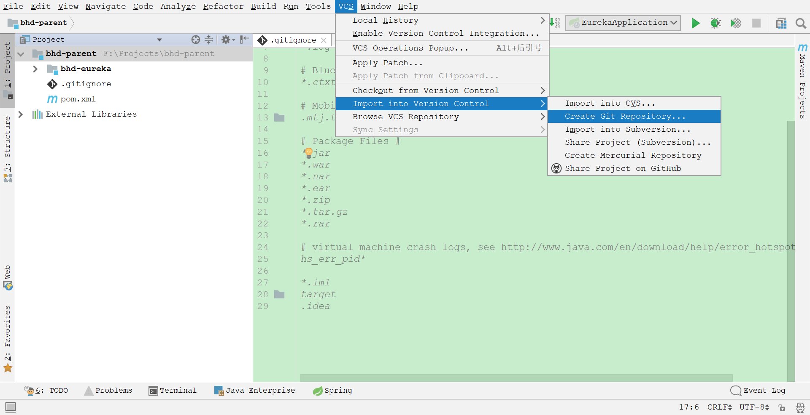
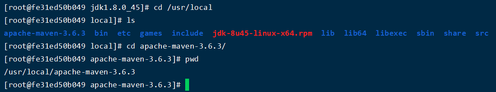

## 课程目标

目标1: 掌握docker部署微服务

目标2: 熟悉GitLab搭建git仓库

目标3: 了解Gogs搭建git仓库

目标4: 熟悉持续集成Jenkins

目标5: 熟悉容器管理Rancher


## 01、基于docker服务部署

#### 1.1 前期准备工作

+ Dockerfile构建镜像

  - Dockerfile其实就是一个文本文件，由一系列命令和参数构成，Docker可以读取Dockerfile文件并根据Dockerfile文件的描述来构建镜像。

  - Dockerfile文件内容一般分为4部分

    - 基础镜像信息
    - 维护者信息
    - 镜像操作指令
    - 容器启动时执行的指令

    | **命令**                           | **作用**                                                     |
    | ---------------------------------- | ------------------------------------------------------------ |
    | FROM image_name:tag                | 定义了使用哪个基础镜像启动构建流程                           |
    | MAINTAINER user_name               | 声明镜像的创建者                                             |
    | ENV key value                      | 设置环境变量 (可以写多条)                                    |
    | RUN command                        | 是Dockerfile的核心部分(可以写多条)                           |
    | ADD source_dir/file dest_dir/file  | 将宿主机的文件复制到容器内，如果是一个压缩文件，将会在复制后自动解压 |
    | COPY source_dir/file dest_dir/file | 和ADD相似，但是如果有压缩文件并不能解压                      |
    | WORKDIR path_dir                   | 设置工作目录                                                 |

    构建jdk1.8镜像:

    ```shell
    # 1、创建目录 
    mkdir -p /usr/local/dockerjdk8 
    cd /usr/local/dockerjdk8 
    
    # 2、下载jdk-8u171-linux-x64.tar.gz并上传到服务器（虚拟机）中的/usr/local/dockerjdk8目录 
    
    # 3、在/usr/local/dockerjdk8目录下创建Dockerfile文件，文件内容如下:
    vi Dockerfile
    
    FROM centos:7
    MAINTAINER ITCAST
    WORKDIR /usr
    RUN mkdir /usr/local/java
    ADD jdk-8u171-linux-x64.tar.gz /usr/local/java/
    ENV JAVA_HOME /usr/local/java/jdk1.8.0_171
    ENV JRE_HOME $JAVA_HOME/jre
    ENV CLASSPATH $JAVA_HOME/lib/dt.jar:$JAVA_HOME/lib/tools.jar:$JRE_HOME/lib:$CLASSPATH
    ENV PATH $JAVA_HOME/bin:$PATH
    
    # 4、执行命令构建镜像；不要忘了后面的那个 . 
    docker build -t='jdk1.8' .
    
    # 5、查看镜像是否建立完成 
    docker images
    ```

     

    > 说明: 创建文件Dockerfile 这里的D必须大写，不能有任何的偏差。

    

#### 1.2 开启docker远程访问

+ 开启端口2375

  ```shell
  vi /lib/systemd/system/docker.service
  
  # 加入下面内容
  ExecStart=/usr/bin/dockerd -H tcp://0.0.0.0:2375 -H unix:///var/run/docker.sock
  ```
    

+ 保存后,重启docker

  ```shell
  # 重新加载服务的配置文件
  systemctl daemon-reload 
  systemctl restart docker
  ```

+ 检查docker是否监听了2375端口，有监听结果代表启动成功

  ```shell
  netstat -ano | grep 2375
  ```
   

+ 本地浏览器访问(有结果代表能够远程访问docker): http://192.168.12.132:2375/version

   

  如果访问不了，可能是防火墙问题，可以关闭防火墙:

  ```shell
  systemctl stop firewalld.service
  systemctl disable firewalld.service
  ```

  

#### 1.3 修改项目配置

+ 配置maven插件:

  ```xml
   <build>
          <finalName>eureka</finalName>
          <plugins>
              <!-- spring-boot-maven-plugin -->
              <plugin>
                  <groupId>org.springframework.boot</groupId>
                  <artifactId>spring-boot-maven-plugin</artifactId>
              </plugin>
              <!-- docker-maven-plugin -->
              <plugin>
                  <groupId>com.spotify</groupId>
                  <artifactId>docker-maven-plugin</artifactId>
                  <version>1.2.0</version>
                  <configuration>
                      <!-- 镜像的名称 -->
                      <imageName>${project.artifactId}:${project.version}</imageName>
                      <!-- 基础镜像 -->
                      <baseImage>jdk1.8</baseImage>
                      <entryPoint>["java","-jar","/${project.build.finalName}.jar"]</entryPoint>
                      <resources>
                          <resource>
                              <targetPath>/</targetPath>
                              <directory>${project.build.directory}</directory>
                              <include>${project.build.finalName}.jar</include>
                          </resource>
                      </resources>
                      <dockerHost>http://192.168.12.132:2375</dockerHost>
                  </configuration>
              </plugin>
          </plugins>
      </build>
  ```

  配置后 在maven的管理页面刷新一下，会出现docker插件 并有一些可执行的命令。

   

  

#### 1.4 执行docker构建

+ 执行: mvn clean package docker:build

  ```txt
  该命令是由4个命令组成:
    clean 代表清空之前maven的打包信息
    package 重新打包最新代码
    docker:build 使用docker的build命令构建镜像
  ```

   

    

  在docker中通过docker images查看，上传成功！！

    

+ 启动成功即可访问:

  ```shell
  # docker run -id --name=容器名称 -p 8761:8761 镜像ID
  docker run -id --name=eureka -p 8761:8761 f590a6981f1a
  ```

   


## 02、搭建git仓库：GitLab

基于git实现的代码仓库有很多，像我们熟知的 Gitee、GitHub、GitLab、Gogs等等，都是支持持续集成的，我们把代码推送到git时，git仓库会触发一个webhooks事件通知对应配置的持续集成软件，触发持续集成软件的对应操作。

#### 2.1 安装Gitlab

- 拉取镜像

  ```shell
  docker pull gitlab/gitlab-ce
  ```

- 准备gitlab工作目录

  ```shell
  # 创建config目录
  mkdir -p /usr/local/gitlab/config
  # 创建logs目录
  mkdir -p /usr/local/gitlab/logs
  # 创建data目录
  mkdir -p /usr/local/gitlab/data
  ```

- 创建运行Gitlab容器

  ```shell
  docker run -d --name=gitlab \
  -p 443:443 -p 80:80 -p 222:22 \
  --restart always \
  -v /usr/local/gitlab/config:/etc/gitlab \
  -v /usr/local/gitlab/logs:/var/log/gitlab \
  -v /usr/local/gitlab/data:/var/opt/gitlab \
  gitlab/gitlab-ce
  ```
   

- 修改gitlab.rb配置文件

  gitlab容器运行没问题，但在gitlab上创建项目的时候，生成项目的URL访问地址是按容器的hostname来生成的，也就是容器的id。作为gitlab服务器，我们需要一个固定的URL访问地址，于是需要配置gitlab.rb（宿主机路径:/usr/local/gitlab/config/gitlab.rb）配置三个参数:

  ```shell
  vi /usr/local/gitlab/config/gitlab.rb
  
  # 添中以下内容
  external_url 'http://192.168.12.132'
  gitlab_rails['gitlab_ssh_host'] = '192.168.12.132'
  gitlab_rails['gitlab_shell_ssh_port'] = 222
  ```

   

- 重启gitlab容器

  ```shell
  docker restart gitlab
  ```

- 浏览器访问: 

   

  用户名/密码: root / root123456

   

   

  

#### 2.2 配置仓库

操作步骤:

+ 第一步: 创建项目

   

   

+ 第二步: 查看ssh与http

   


#### 2.3 上传代码到仓库

操作步骤:

+ 第一步: 添加忽略文件

   

+ 第二步: 创建本地仓库

   

   

+ 第三步: 提交代码到本地仓库

   

+ 第四步: 同步本地仓库到GitLab

   

   

+ 第五步: 查看GitLab

   


## 03、搭建git仓库：Gogs

Gogs 的目标是打造一个最简单、最快速和最轻松的方式搭建自助 Git 服务。使用 Go 语言开发使得Gogs 能够通过独立的二进制分发，并且支持 Go 语言支持的 所有平台，包括Linux、Mac OS X、Windows 以及 ARM 平台。

官网地址: <http://www.acrit.com/> 

 

#### 3.1 安装gogs

拉取镜像:

```shell
# 先停止GitLab(比较耗内存)
docker stop gitlab
docker stop eureka

# 拉取gogs镜像
docker pull gogs/gogs
```

创建容器:

```shell
# 创建目录
mkdir -p /usr/local/gogs/data

# 创建运行容器
docker run -d --name=gogs -p 10022:22 -p 3000:3000 -v /usr/local/gogs/data:/data gogs/gogs
```


#### 3.2 配置仓库

+ 在地址栏输入 http://192.168.12.132:3000 会首次运行安装程序页面，我们可以选择一种数据库作为gogs数据的存储,最简单的是选择SQLite3。如果对于规模较大的公司可以选择mysql。

   

  

     

  注册:

   

   

  登录: root / root123456

    

  创建仓库:

    

    

  为了便于演示，这里我们只需要填写一个仓库名称即可，可见性不要勾选，然后点击创建仓库。

  

#### 3.3 上传代码到仓库

操作步骤:

+ 第一步: 更改远程仓库为Gogs

   

   

   

+ 第二步: 同步本地仓库到Gogs

   

   

   

   

   

+ 第三步: 查看Gogs

   


## 04、持续集成：介绍

#### 4.1 什么是持续集成

持续集成Continuous integration，简称CI 随着软件开发复杂度的不断提高，团队开发成员间如何更好地协同工作以确保软件开发的质量已经慢慢成为开发过程中不可回避的问题。尤其是近些年来，敏捷Agile在软件工程领域越来越红火，如何能再不断变化的需求中快速适应和保证软件的质量也显得尤其的重要。持续集成正是针对这一类问题的一种软件开发实践。它倡导团队开发成员必须经常集成他们的工作，甚至每天都可能发生多次集成。而每次的集成都是通过自动化的构建来验证，包括自动编译、发布和测试，从而尽快地发现集成错误，让团队能够更快的开发内聚的软件。

#### 4.2 持续集成的特点

它是一个自动化的周期性的集成测试过程，**从检出代码、编译构建、运行测试、结果记录、测试统计等都是自动完成的，无需人工干预**；需要有专门的集成服务器来执行集成构建；需要有代码托管工具支持，我们下一小节将介绍Git以及可视化界面Gogs的使用。

#### 4.3 持续集成作用

保证团队开发人员提交代码的质量，**减轻了软件发布时的压力**；持续集成中的任何一个环节都是自动完成的，无需太多的人工干预，有利于减少重复过程以节省时间、费用和工作量。


## 05、持续集成：Jenkins介绍

官方网站: <https://www.jenkins.io/zh/> 

 

+ Jenkins原名Hudson，2011年改为现在的名字，它是一个开源的实现持续集成的软件工具。
+ Jenkins是一款开源 CI&CD 软件领导者，提供超过1000个插件来支持: 自动化构建、部署、满足任何项目的需要。
+ Jenkins能实施监控集成中存在的错误，提供详细的日志文件和提醒功能，还能用图表的形式形象地展示项目构建的趋势和稳定性。 

 **特点:** 

+ 易配置：提供友好的GUI配置界面。
+ 变更支持：Jenkins能从代码仓库（CVS/SVN/Git）中获取代码更新列表并输出到编译输出信息中。
+ 支持永久链接：用户是通过web来访问Jenkins的，而这些web页面的链接地址都是永久链接地址，因此，你可以在各种文档中直接使用该链接。
+ 集成E-Mail/RSS/IM: 当完成一次集成时，可通过这些工具实时告诉你集成结果（据我所知，构建一次集成需要花费一定时间，有了这个功能，你就可以在等待结果过程中，干别的事情）。
+ JUnit/TestNG测试报告: 也就是用以图表等形式提供详细的测试报表功能。
+ 支持分布式构建: Jenkins可以把集成构建等工作分发到多台计算机中完成。
+ 支持第三方插件: 使得Jenkins变得越来越强大。


## 06、持续集成：搭建Jenkins

#### 6.1 安装jenkins

+ 拉取jenkins镜像

  ```shell
  docker pull jenkins/jenkins:lts-centos7
  ```

+ 创建jenkins容器

  ```shell
  docker run -d --name=jenkins -p 8888:8080 jenkins/jenkins:lts-centos7
  ```


#### 6.2 配置jenkins

+ 配置镜像加速: jenkins官方镜像下载速度特别慢，需要配置国内镜像。

  参考解决方法: https://blog.csdn.net/u013788943/article/details/103822785

  课件中已经提供了老师修改后的default.json 只需要复制到镜像替换原来的即可。

  ```shell
  # 1. rz 上传default.json文件
  
  # 2. 将当前文件夹下的default.json文件复制到容器中
  docker cp default.json jenkins:/var/jenkins_home/updates/default.json
  
  # 3. 重启jenkins
  docker restart jenkins
  ```

+ 访问配置: http://192.168.12.132:8888 访问jenkins，提示需要解锁。

    

  ```shell
  # 进入容器
  docker exec -it -u root jenkins bash
  
  # 查看密钥
  cat /var/jenkins_home/secrets/initialAdminPassword
  ```

    

  复制密钥 到浏览器 并点击继续。

   

  进入jenkins欢迎页面:

   

+ 修改admin的密码: 123456

   

   

   

+ 创建新用户

  第一步:

   

  第二步:

   

  第三步:

   


## 07、持续集成：使用Jenkins

#### 7.1 安装maven插件

+ 点击系统管理 --> 插件管理

   

+ 在可选插件面板 输入maven 勾选Maven Integration后下载插件

   

   

   

  

#### 7.2 安装git插件

与上面步骤一样 安装git插件:

 

 


#### 7.3 全局工具配置

+ Jenkins容器安装Maven与JDK

  将maven和jdk拷贝到容器中:

  ```shell
  # 1. rz 上传maven与jdk
  
  # 2. 将资源拷贝到容器
  docker cp jdk-8u45-linux-x64.rpm jenkins:/usr/local/
  docker cp apache-maven-3.6.3-bin.tar.gz jenkins:/usr/local/
  
  # 3. 以root用户进入容器
  docker exec -it -u root jenkins bash
  ```

   

   

  安装jdk:

  ```shell
  cd /usr/local
  # 安装jdk 会被安装到这个目录: /usr/java/jdk1.8.0_45
  rpm -ivh jdk-8u45-linux-x64.rpm
  
  # 配置环境变量
  vi /etc/profile
  
  export PATH USER LOGNAME MAIL HOSTNAME HISTSIZE HISTCONTROL
  export JAVA_HOME=/usr/java/jdk1.8.0_45
  export CLASSPATH=.:$JAVA_HOME/lib/dt.jar:$JAVA_HOME/lib/tools.jar
  export PATH=$JAVA_HOME/bin:$PATH
  
  # 使配置生效
  source /etc/profile
  ```

   

   

  安装maven:

  ```shell
  cd /usr/local
  # 解压maven
  tar -zxvf apache-maven-3.6.3-bin.tar.gz
  
  # 配置阿里云镜像 /usr/local/apache-maven-3.6.3/bin
  vi /usr/local/apache-maven-3.6.3/conf/settings.xml
  
  
  <!-- 阿里云仓库 -->
  <mirror>
  	<id>alimaven</id>
  	<mirrorOf>central</mirrorOf>
  	<name>aliyun maven</name>
      <url>http://maven.aliyun.com/nexus/content/repositories/central/</url>
  </mirror>
  ```

   

   

  

+ 全局工具配置【jdk】

  点击【系统管理】-->【全局工具配置】

   

  点击新增JDK:

   

   

  

+ 全局Maven配置

   

   


#### 7.4 创建Maven任务

+ 新建任务

   

+ 填写项目名称,选择任务模板

   

+ 在源码管理，选择git并输入git的项目地址

   

+ 在构建环境，填写对应的pom.xml 及 要执行的命令

    

  ```shell
  # 清除  打包  构建docker镜像
  clean package docker:build
  ```

  

+ 回到主页面，点击右侧按钮，开始自动构建:

   

  点击进度条，即可查看该任务输出日志:

   

  第一次运行时需要下载maven相关依赖

   

    

   

  查看docker中已经有了我们的镜像:

    


## 08、持续集成：搭建Rancher

#### 8.1 Rancher简介

Rancher是一套容器管理平台,它可以帮助组织在生产环境中轻松快捷的部署和管理容器。

Rancher为采用容器的团队提供了完整的软件堆栈，解决了跨任何基础设施架构管理多个Kubernetes集群的运维和安全挑战，同时为DevOps团队提供了用于运行容器化工作负载的集成工具。

官网地址: <https://www.rancher.cn/> 

 

 


#### 8.2 安装Rancher

+ 拉取Rancher镜像

  ```shell
  docker pull rancher/server
  ```

+ 创建Rancher容器

  ```shell
  docker run -d --name=rancher -p 9090:8080 rancher/server
  ```

   

+ 浏览器访问: http://192.168.12.132:9090

   

+ 切换至中文界面

   

   


#### 8.3 Rancher初始化

##### 8.3.1 添加环境

Rancher 支持将资源分组归属到多个环境。 每个环境具有自己独立的基础架构资源及服务，并由一个或多个用户、团队或组织所管理。
例如，您可以创建独立的“开发”、“测试”及“生产”环境以确保环境之间的安全隔离，将“开发”环境的访问权限赋予全部人员，但限制“生产”环境的访问权限给一个小的团队。

+ 进行环境管理

   

   

+ 添加三个环境(开发、测试、生产)

   

   

   

   

+ 通过下拉菜单选择不同的环境

   


##### 8.3.2 配置主机

以myapp_pro生产环境为例，选择生产环境，配置该生产环境所对应的主机。


点击添加主机:

 

点击保存:

 

复制红框的脚本内容:


将上面复制的内容 拷贝到我们的虚拟机中执行:

 

执行完后，回到主机页面，稍等一会刷新页面可以看到主机信息，代表rancher已经连接到我们的服务器:

 

可以选择不显示系统容器:

 


##### 8.3.3 创建容器

+ 点击【基础架构】菜单中的【容器】，进入到容器管理页面，可以看到当前服务器的容器列表。

   

+ 点击【添加容器】按钮，创建容器:

  填写名称、描述、端口映射等容器信息，点击下面的创建，即可创建容器。

    

   

    

+ 查看容器列表

     

+ 浏览器访问: <http://192.168.12.132:8762/> 

   

  